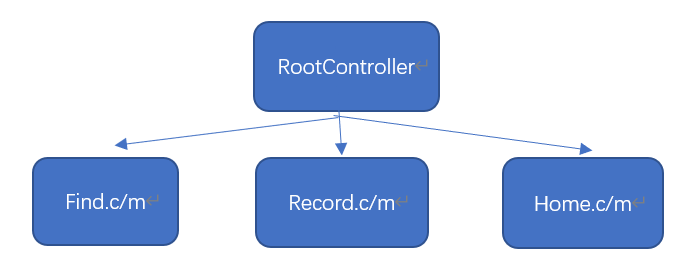
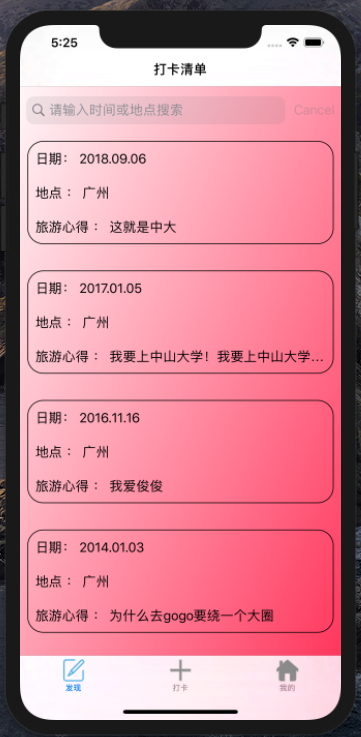
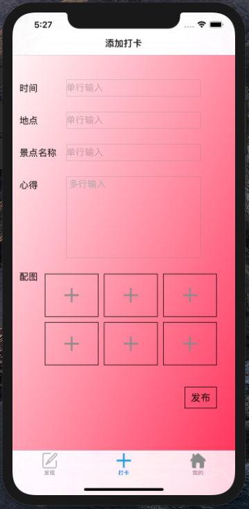
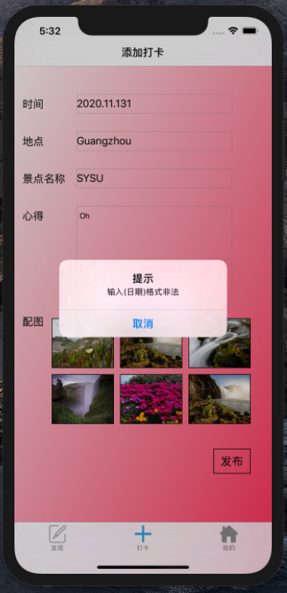
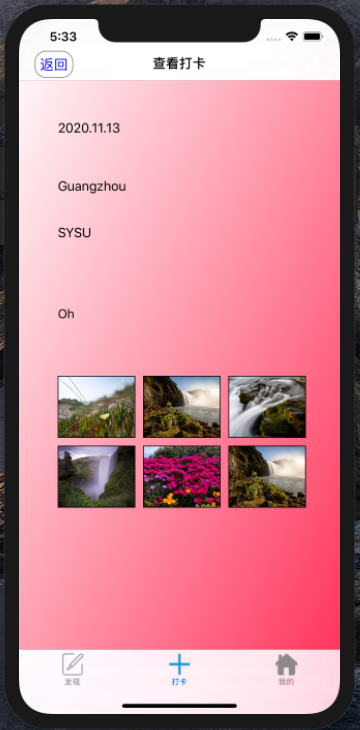
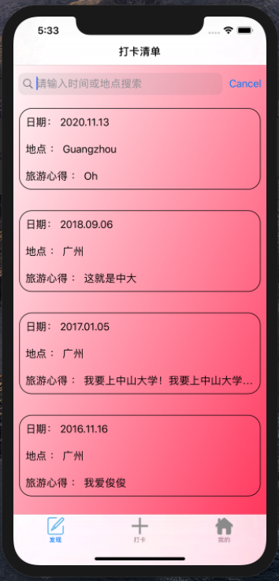
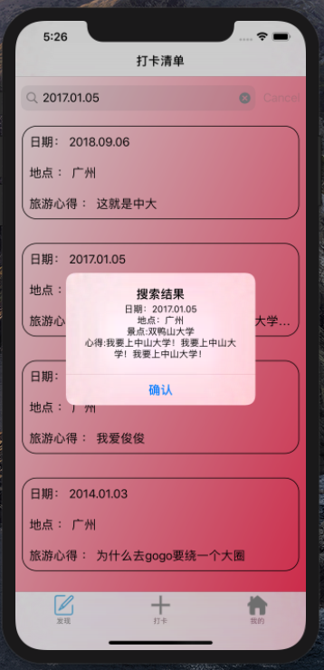
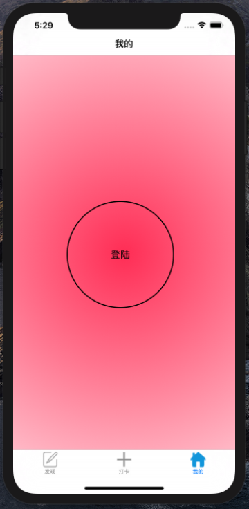
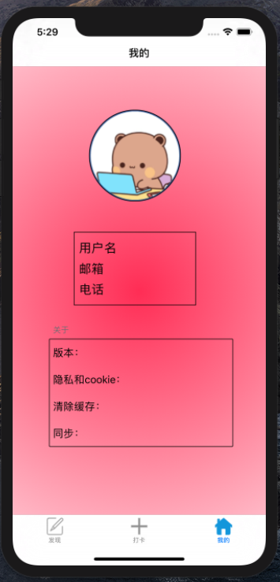

# MOSAD_HW2
学号：18342069

姓名：罗炜乐
<!-- TOC -->

- [MOSAD_HW2](#mosad_hw2)
    - [总体概述](#总体概述)
    - [实现效果](#实现效果)
    - [根控制器初始化](#根控制器初始化)
        - [AppDelegate选择根控制器](#appdelegate选择根控制器)
        - [把页面添加到根控制器中](#把页面添加到根控制器中)
    - [登陆页面的实现](#登陆页面的实现)
        - [把各个部件添加到本页面的子视图中](#把各个部件添加到本页面的子视图中)
            - [最上面的两个 UINavigationBar](#最上面的两个-uinavigationbar)
            - [登陆按钮的实现](#登陆按钮的实现)
    - [添加打卡页面的实现](#添加打卡页面的实现)
        - [把各个部件添加到本页面的子视图中](#把各个部件添加到本页面的子视图中-1)
            - [最上面的两个 UINavigationBar](#最上面的两个-uinavigationbar-1)
            - [时间、地点和心得使用 UITextField 单行输入](#时间地点和心得使用-uitextfield-单行输入)
            - [心得使用 UITextView 多行输入](#心得使用-uitextview-多行输入)
            - [添加图片使用 UIButton](#添加图片使用-uibutton)
            - [发布按钮的实现](#发布按钮的实现)
            - [按下发布按钮后的弹窗实现](#按下发布按钮后的弹窗实现)
    - [查看打卡页面的实现](#查看打卡页面的实现)
        - [把各个部件添加到本页面的子视图中](#把各个部件添加到本页面的子视图中-2)
            - [最上面的两个 UINavigationBar](#最上面的两个-uinavigationbar-2)
            - [时间、地点、景点、心得的显示](#时间地点景点心得的显示)
            - [照片的显示](#照片的显示)
            - [左上角的返回按钮](#左上角的返回按钮)
    - [打卡清单页面的实现](#打卡清单页面的实现)
        - [初始化一些数据](#初始化一些数据)
        - [把各个部件添加到本页面的子视图中](#把各个部件添加到本页面的子视图中-3)
            - [最上面的两个 UINavigationBar](#最上面的两个-uinavigationbar-3)
            - [搜索栏](#搜索栏)
            - [设置清单的框](#设置清单的框)
            - [清单的打卡记录框被点击的效果](#清单的打卡记录框被点击的效果)
            - [与添加打卡进行数据交互功能](#与添加打卡进行数据交互功能)
    - [心得体会](#心得体会)

<!-- /TOC -->
## 总体概述

主要实现结构如下



其中
- RootController 使用 UITabBarController 作为**根控制器**。
- Find 继承 UIViewController，实现了打卡清单的相关功能。
- Record 继承 UIViewController，实现了查看打卡和添加打卡两个页面的相关功能。
- Home 继承 UIViewController， 实现了登陆页面的相关功能。

## 实现效果

由于动画已经通过了现场验收，就不录视频了。

- 打卡清单



- 添加打卡



- 非法日期



- 查看打卡/成功打卡



- 打卡后清单



- 搜索结果



- 登陆页面



- 个人信息




## 根控制器初始化
### AppDelegate选择根控制器
```objectivec
- (BOOL)application:(UIApplication *)application didFinishLaunchingWithOptions:(NSDictionary *)launchOptions {
    // 创建窗口
    self.window = [[UIWindow alloc] init];
    self.window.frame = [UIScreen mainScreen].bounds;
    
    // 设置窗口的根控制器
    self.window.rootViewController = [[RootTabBarController alloc] init];;
    
    // 显示窗口
    [self.window makeKeyAndVisible];

    return YES;
}
```

### 把页面添加到根控制器中
```objectivec
-(void) viewDidLoad {
    [super viewDidLoad];
    Find *find = [Find new];
    ClockIn *clockIn = [ClockIn new];
    Home *home = [Home new];
    
    find.tabBarItem = [[UITabBarItem alloc]initWithTitle:@"发现"
                                         image:[[UIImage imageNamed:@"编辑灰色.png"]imageWithRenderingMode:UIImageRenderingModeAlwaysOriginal ]
                                         selectedImage:[[UIImage imageNamed:@"编辑.png"]imageWithRenderingMode:UIImageRenderingModeAlwaysOriginal ]];
    clockIn.tabBarItem = [[UITabBarItem alloc]initWithTitle:@"打卡"
                                         image:[[UIImage imageNamed:@"增加灰色.png"]imageWithRenderingMode:UIImageRenderingModeAlwaysOriginal ]
                                         selectedImage:[[UIImage imageNamed:@"增加.png"]imageWithRenderingMode:UIImageRenderingModeAlwaysOriginal ]];
    home.tabBarItem = [[UITabBarItem alloc]initWithTitle:@"我的"
                                         image:[[UIImage imageNamed:@"我的灰色.png"]imageWithRenderingMode:UIImageRenderingModeAlwaysOriginal ]
                                         selectedImage:[[UIImage imageNamed:@"我的.png"]imageWithRenderingMode:UIImageRenderingModeAlwaysOriginal ]];
    [self addChildViewController:find];
    [self addChildViewController:clockIn];
    [self addChildViewController:home];
    clockIn.delegae = find;
}
```
此时，就可以通过下面三个 tab 实现页面之间的切换了。

## 登陆页面的实现
### 把各个部件添加到本页面的子视图中

```objectivec
- (void)viewDidLoad{
    [super viewDidLoad];
    
    UIImage *img = [self getBackgroundImg];
    UIImageView *imgView = [[UIImageView alloc] initWithImage:img];
    [self.view addSubview:imgView];
    self.view.backgroundColor = [UIColor whiteColor];
    
    [self.view addSubview:self.emptyNBar];
    [self.view addSubview:self.headNBar];
    [self.view addSubview:self.login];
    self.view.backgroundColor = [UIColor whiteColor];
}
```
上面代码的作用就是添加背景和各个部件。
#### 最上面的两个 UINavigationBar
其中，emptyNBar 和 headNBar 在每个页面都会用到，其作用就是实现填充最上面的内容，其实现如下，_emptyNBar 和 _headNBar 是每个页面的属性变量。
```objectivec
-(UINavigationBar *)emptyNBar{
    if (_emptyNBar == nil) {
        _emptyNBar = [[UINavigationBar alloc] initWithFrame:CGRectMake(0, 0, self.view.frame.size.width, 35)];
        [_emptyNBar pushNavigationItem:[UINavigationItem new] animated:NO];
        _emptyNBar.backgroundColor = [UIColor whiteColor];
    }
    return _emptyNBar;
}

-(UINavigationBar *)headNBar{
    if (_headNBar == nil) {
        _headNBar = [[UINavigationBar alloc] initWithFrame:CGRectMake(0, 35, self.view.frame.size.width, 35)];
        [_headNBar pushNavigationItem:[[UINavigationItem alloc] initWithTitle:@"我的"] animated:YES];
        _headNBar.backgroundColor = [UIColor whiteColor];
    }
    return _headNBar;
}
```
#### 登陆按钮的实现
主要是登陆按钮的样式的设计和按钮被按下后的操作设计，当按钮被按下后，立刻将本按钮隐藏，然后将接下来要显示的“头像”、“用户信息”和“关于”等三个“框”添加到子页面，这登陆后的子页面只需对样式进行设计，此处不赘述。


```objectivec
#pragma mark 登陆按钮的实现
-(UIButton *)login{
    if (_login == nil) {
        _login = [[UIButton alloc]initWithFrame:CGRectMake(100, 350, 200, 200)];
        [_login.layer setBorderWidth:2.0];
        [_login.layer setBorderColor:[UIColor blackColor].CGColor];
        [_login.layer setCornerRadius:100.0];
        NSMutableAttributedString *str = [[NSMutableAttributedString alloc] initWithString:[NSString stringWithFormat:@"%@", @"登陆"]];
        [str addAttribute:NSForegroundColorAttributeName value:[UIColor blackColor]range:NSMakeRange(0,2)];
        [_login setAttributedTitle:str forState:UIControlStateNormal];
        [_login addTarget:self action:@selector(btnClick:) forControlEvents:UIControlEventTouchUpInside];
    }
    return _login;
}

-(void)btnClick:(id)sender{
    _login.hidden = YES;
    [self.view addSubview:self.avatar];
    [self.view addSubview:self.about];
    [self.view addSubview:self.user];
}
```

## 添加打卡页面的实现

### 把各个部件添加到本页面的子视图中

```objc
-(void)viewDidLoad{
    [super viewDidLoad];

    CAGradientLayer * gradientLayer = [CAGradientLayer layer];
    gradientLayer.frame = self.view.bounds;
    [self.view.layer addSublayer:gradientLayer];
    gradientLayer.colors = @[(id)[UIColor whiteColor].CGColor, (id)[UIColor systemPinkColor].CGColor];
    gradientLayer.startPoint = CGPointMake(0, 0);
    gradientLayer.endPoint = CGPointMake(1, 1);
    self.view.backgroundColor = [UIColor whiteColor];
    
    [self.view addSubview:self.emptyNBar];
    [self.view addSubview:self.headNBar];
    [self.view addSubview:self.dateLabel];
    [self.view addSubview:self.dateText];
    [self.view addSubview:self.placeLabel];
    [self.view addSubview:self.placeText];
    [self.view addSubview:self.attractionsLabel];
    [self.view addSubview:self.attractionsText];
    [self.view addSubview:self.experienceLabel];
    [self.view addSubview:self.experienceText];
    [self.view addSubview:self.photoLabel];
    [self.view addSubview:self.picBtn1];
    [self.view addSubview:self.picBtn2];
    [self.view addSubview:self.picBtn3];
    [self.view addSubview:self.picBtn4];
    [self.view addSubview:self.picBtn5];
    [self.view addSubview:self.picBtn6];
    [self.view addSubview:self.makeRecord];
}
```
#### 最上面的两个 UINavigationBar
与登陆页面一样，此处不赘述。
#### 时间、地点和心得使用 UITextField 单行输入  
以时间为例子，其余两个实现和这个大同小异
```objc
#pragma mark 时间的标签和输入
-(UILabel *) dateLabel{
    if (_dateLabel == nil) {
        _dateLabel = [[UILabel alloc]initWithFrame:CGRectMake(13, 120, 70, 40)];
        _dateLabel.text = @"时间";
        _dateLabel.textAlignment = NSTextAlignmentLeft;
        _dateLabel.adjustsFontSizeToFitWidth = YES;
    }
    return _dateLabel;
}

-(UITextField *)dateText{
    if(_dateText == nil){
        _dateText = [[UITextField alloc]initWithFrame:CGRectMake(100, 125, 250, 30)];
        _dateText.layer.borderWidth = 0.3;
        _dateText.layer.borderColor = [UIColor grayColor].CGColor;
        [_dateText setPlaceholder:@"单行输入"];
        [_dateText setTextColor:[UIColor blackColor]];
        [_dateText setSecureTextEntry:NO];
        [_dateText setKeyboardType:UIKeyboardTypeDefault];
        [_dateText setReturnKeyType:UIReturnKeyDone];
    }
    return _dateText;
}
```
#### 心得使用 UITextView 多行输入
UITextView 原本不支持占位符，要进行额外的实现如下
```objc
#pragma mark 心得的标签和输入
-(UILabel *) experienceLabel{
    if (_experienceLabel == nil) {
        _experienceLabel = [[UILabel alloc]initWithFrame:CGRectMake(13, 300, 70, 40)];
        _experienceLabel.text = @"心得";
        _experienceLabel.textAlignment = NSTextAlignmentLeft;
        _experienceLabel.adjustsFontSizeToFitWidth = YES;
    }
    return _experienceLabel;
}

-(UITextView *) experienceText{
    if (_experienceText == nil) {
        _experienceText = [[UITextView alloc]initWithFrame:CGRectMake(100, 305, 250, 150)];
        _experienceText.layer.borderColor = [UIColor grayColor].CGColor;
        _experienceText.layer.borderWidth = 0.3;
        _experienceText.text = @"";
        _experienceText.backgroundColor=[UIColor colorWithRed:1 green:1 blue:1 alpha:0];
        [_experienceText setKeyboardType:UIKeyboardTypeDefault];
        [_experienceText setReturnKeyType:UIReturnKeyDone];
        // _placeholderLabel
        UILabel *placeHolderLabel = [[UILabel alloc] init];
        placeHolderLabel.text = @"多行输入";
        placeHolderLabel.numberOfLines = 0;
        placeHolderLabel.textColor = [UIColor lightGrayColor];
        [_experienceText addSubview:placeHolderLabel];
        [_experienceText setValue:placeHolderLabel forKey:@"_placeholderLabel"];
    }
    return _experienceText;
}
```

#### 添加图片使用 UIButton
把 UIButton 的背景图片设置为灰色加号，点击后可参考TA给的链接实现从系统选择图片的功能。
```objc
-(UIButton *)picBtn1{
    if (_picBtn1 == nil) {
        _picBtn1 = [[UIButton alloc]initWithFrame:CGRectMake(60, 485, 100, 80)];
        [_picBtn1 setShowsTouchWhenHighlighted:NO];
        [_picBtn1.layer setBorderWidth:1.0];
        [_picBtn1.layer setBorderColor:[UIColor blackColor].CGColor];
        [_picBtn1 setImage:[UIImage imageNamed:@"增加灰色.png"] forState:UIControlStateNormal];
        [_picBtn1 setTag:1];
        [_picBtn1 addTarget:self action:@selector(selectphoto:) forControlEvents:UIControlEventTouchUpInside];
    }
    return _picBtn1;
}
```
#### 发布按钮的实现
```objc
-(UIButton *)makeRecord{
    if (_makeRecord == nil) {
        _makeRecord = [[UIButton alloc]initWithFrame:CGRectMake(320, 695, 60, 40)];
        [_makeRecord setShowsTouchWhenHighlighted:YES];
        [_makeRecord.layer setBorderWidth:1.0];
        [_makeRecord.layer setBorderColor:[UIColor blackColor].CGColor];
        NSString * aStr = @"发布";
        NSMutableAttributedString *str = [[NSMutableAttributedString alloc] initWithString:aStr];
        [str addAttribute:NSForegroundColorAttributeName value:[UIColor blackColor]range:NSMakeRange(0,2)];
        [_makeRecord setAttributedTitle:str forState:UIControlStateNormal];
        [_makeRecord addTarget:self action:@selector(btnClick:) forControlEvents:UIControlEventTouchUpInside];
    }
    return _makeRecord;
}
```
#### 按下发布按钮后的弹窗实现
弹窗分为成功发布和非法格式输入，if (textDate == nil) 成立则是非法格式输入，按下发布后弹窗。如果是合法格式，则弹出一个0.5s的弹窗并新建一个查看打卡的页面添加进子视图，把输入数据传给代理（清单页面），然后将各个框的 text 清空。这个0.5s太短了，在虚拟机里很卡，我没有截到图。

 

```objc
#pragma mark 发布按钮按下后的弹窗
-(void)btnClick:(UIButton*)sender{
    if (self.delegae &&[self.delegae conformsToProtocol:@protocol(sender)]) {
        NSDateFormatter *dateFormatter = [[NSDateFormatter alloc] init];
        [dateFormatter setDateFormat:@"yyyy.MM.dd"];
        NSDate *textDate = [dateFormatter dateFromString:_dateText.text];
        if (textDate == nil) {
            UIAlertController *alertVc =[UIAlertController alertControllerWithTitle:@"提示" message:@"输入(日期)格式非法" preferredStyle:UIAlertControllerStyleAlert];
            [self presentViewController:alertVc animated:NO completion:nil];
            [alertVc addAction:[UIAlertAction actionWithTitle:@"取消"
                                                        style: UIAlertActionStyleCancel
                                                      handler:^(UIAlertAction*action) {NSLog(@"点击了取消按钮");}]];
            return;
        }
        _addarr = @[textDate,_placeText.text,_attractionsText.text,_experienceText.text,
                    _picBtn1.currentImage,_picBtn2.currentImage,_picBtn3.currentImage,
                    _picBtn4.currentImage,_picBtn5.currentImage,_picBtn6.currentImage];
        [self.delegae send:_addarr];//data

        UIAlertController *aleView=[UIAlertController alertControllerWithTitle:@"提示" message:@"成功打卡" preferredStyle:UIAlertControllerStyleAlert];
        [self presentViewController:aleView animated:YES completion:nil];
        [self performSelector:@selector(dismiss:) withObject:aleView afterDelay:0.5];
        Examine *examine = [[Examine alloc]init];
        examine.date = textDate;
        examine.place = _placeText.text;
        examine.attractions = _attractionsText.text;
        examine.experience = _experienceText.text;
        examine.photo1 = _picBtn1.currentImage;
        examine.photo2 = _picBtn2.currentImage;
        examine.photo3 = _picBtn3.currentImage;
        examine.photo4 = _picBtn4.currentImage;
        examine.photo5 = _picBtn5.currentImage;
        examine.photo6 = _picBtn6.currentImage;
        _dateText.text = @"";
        _placeText.text = @"";
        _attractionsText.text = @"";
        _experienceText.text = @"";
        [_picBtn1 setImage:[UIImage imageNamed:@"增加灰色.png"] forState:UIControlStateNormal];
        [_picBtn2 setImage:[UIImage imageNamed:@"增加灰色.png"] forState:UIControlStateNormal];
        [_picBtn3 setImage:[UIImage imageNamed:@"增加灰色.png"] forState:UIControlStateNormal];
        [_picBtn4 setImage:[UIImage imageNamed:@"增加灰色.png"] forState:UIControlStateNormal];
        [_picBtn5 setImage:[UIImage imageNamed:@"增加灰色.png"] forState:UIControlStateNormal];
        [_picBtn6 setImage:[UIImage imageNamed:@"增加灰色.png"] forState:UIControlStateNormal];
        [self addChildViewController:examine];
        
        CATransition *animation = [CATransition animation];
        animation.timingFunction = [CAMediaTimingFunction functionWithName:kCAMediaTimingFunctionEaseIn];
        animation.type = @"cube";
        animation.duration = 0.5;
        animation.subtype = kCATransitionFromBottom;
        [self.view.layer addAnimation:animation forKey:nil];
        
        [self.view addSubview:examine.view];
    }
}
```


## 查看打卡页面的实现
### 把各个部件添加到本页面的子视图中

```objc
-(void)viewDidLoad{
    [super viewDidLoad];
    
    CAGradientLayer * gradientLayer = [CAGradientLayer layer];
    gradientLayer.frame = self.view.bounds;
    [self.view.layer addSublayer:gradientLayer];
    gradientLayer.colors = @[(id)[UIColor whiteColor].CGColor, (id)[UIColor systemPinkColor].CGColor];
    gradientLayer.startPoint = CGPointMake(0, 0);
    gradientLayer.endPoint = CGPointMake(1, 1);
    
    [self.view addSubview:self.emptyNBar];
    [self.view addSubview:self.headNBar];
    [self.view addSubview:self.dateLabel];
    [self.view addSubview:self.placeLabel];
    [self.view addSubview:self.experienceLabel];
    [self.view addSubview:self.attractionsLabel];
    [self.view addSubview:self.picBtn1];
    [self.view addSubview:self.picBtn2];
    [self.view addSubview:self.picBtn3];
    [self.view addSubview:self.picBtn4];
    [self.view addSubview:self.picBtn5];
    [self.view addSubview:self.picBtn6];
    [self.view addSubview:self.returnBtn];
}
```
#### 最上面的两个 UINavigationBar
与登陆页面一样，此处不赘述。
#### 时间、地点、景点、心得的显示
使用一个 UILabel 调整好位置即可，以时间为例，其他的实现大同小异
```objc
#pragma mark 显示日期的标签
-(UILabel *) dateLabel{
    if (_dateLabel == nil) {
        _dateLabel = [[UILabel alloc]initWithFrame:CGRectMake(50, 125, 320, 30)];
        NSDateFormatter *dateFormatter = [[NSDateFormatter alloc] init];
        [dateFormatter setDateFormat:@"yyyy.MM.dd"];
        _dateLabel.text = [[NSString alloc] initWithFormat:@"%@", [dateFormatter stringFromDate:(NSDate * _Nonnull)_date]];
        _dateLabel.textAlignment = NSTextAlignmentLeft;
        _dateLabel.adjustsFontSizeToFitWidth = YES;
    }
    return _dateLabel;
}
```
#### 照片的显示
和添加打卡一样，使用 UIButton，把图片设置为按钮的背景图片。
```objc
#pragma mark 显示照片的按钮
-(UIButton *)picBtn1{
    if (_picBtn1 == nil) {
        _picBtn1 = [[UIButton alloc]initWithFrame:CGRectMake(50, 460, 100, 80)];
        [_picBtn1.layer setBorderWidth:1.0];
        [_picBtn1.layer setBorderColor:[UIColor blackColor].CGColor];
        [_picBtn1 setImage:_photo1 forState:UIControlStateNormal];
    }
    return _picBtn1;
}
```

#### 左上角的返回按钮
调整好位置和样式，如果被点击就把自己从父视图里移除。
```objc
#pragma mark 返回按钮的实现
-(UIButton *)returnBtn{
    if (_returnBtn == nil) {
        _returnBtn = [[UIButton alloc]initWithFrame:CGRectMake(20, 41, 50, 35)];
        [_returnBtn setShowsTouchWhenHighlighted:YES];
        [_returnBtn.layer setBorderWidth:1.0];
        [_returnBtn.layer setBorderColor:[UIColor grayColor].CGColor];
        [_returnBtn.layer setCornerRadius:15.0];
        [_returnBtn addTarget:self action:@selector(btnClick:) forControlEvents:UIControlEventTouchUpInside];
        NSMutableAttributedString *str = [[NSMutableAttributedString alloc] initWithString:[NSString stringWithFormat:@"%@",@"返回"]];
        [str addAttribute:NSForegroundColorAttributeName value:[UIColor blueColor]range:NSMakeRange(0,2)];
        [_returnBtn setAttributedTitle:str forState:UIControlStateNormal];
    }
    return _returnBtn;
}

-(void)btnClick:(UIButton*)sender{
    self.view.hidden = YES;
    [self removeFromParentViewController];
}
```

## 打卡清单页面的实现
### 初始化一些数据

```objc
#pragma mark "打卡清单"页面初始化
- (id)init{
    self = [super init];
    NSDateFormatter *dateFormatter = [[NSDateFormatter alloc] init];
    [dateFormatter setDateFormat:@"yyyy.MM.dd"];
    _date = [[NSMutableArray alloc]init];
    [_date  addObject:[dateFormatter dateFromString:@"2018.9.6"]];
    [_date addObject:[dateFormatter dateFromString:@"2017.1.5"]];
    [_date addObject:[dateFormatter dateFromString:@"2016.11.16"]];
    [_date addObject:[dateFormatter dateFromString:@"2014.1.3"]];
    [_date addObject:[dateFormatter dateFromString:@"2010.4.21"]];
    [_date addObject:[dateFormatter dateFromString:@"1998.5.1"]];
    _place = [[NSMutableArray alloc]initWithObjects:@"广州",@"广州",@"广州",@"广州",@"广州",@"广州", nil];
    _attractions = [[NSMutableArray alloc]initWithObjects:@"中山大学",@"双鸭山大学",@"大山中学",@"大学山中",@"山中大学",@"新港西路", nil];
    _experience = [[NSMutableArray alloc]initWithObjects:@"这就是中大",@"我要上中山大学！我要上中山大学！我要上中山大学！",@"我爱俊俊",@"为什么去gogo要绕一个大圈",@"怎么才能考上中山大学",@"学计算机挺好的，就是头有点秃", nil];
    _photo = [[NSMutableArray alloc]initWithObjects:[UIImage imageNamed:@"sysu1.jpg"],[UIImage imageNamed:@"sysu2.jpg"],[UIImage imageNamed:@"sysu3.jpg"],[UIImage imageNamed:@"sysu4.jpg"],[UIImage imageNamed:@"sysu5.jpeg"],[UIImage imageNamed:@"sysu6.jpeg"],[UIImage imageNamed:@"sysu1.jpg"],[UIImage imageNamed:@"sysu2.jpg"],[UIImage imageNamed:@"sysu3.jpg"],[UIImage imageNamed:@"sysu4.jpg"],[UIImage imageNamed:@"sysu5.jpeg"],[UIImage imageNamed:@"sysu6.jpeg"],[UIImage imageNamed:@"sysu1.jpg"],[UIImage imageNamed:@"sysu2.jpg"],[UIImage imageNamed:@"sysu3.jpg"],[UIImage imageNamed:@"sysu4.jpg"],[UIImage imageNamed:@"sysu5.jpeg"],[UIImage imageNamed:@"sysu6.jpeg"],[UIImage imageNamed:@"sysu1.jpg"],[UIImage imageNamed:@"sysu2.jpg"],[UIImage imageNamed:@"sysu3.jpg"],[UIImage imageNamed:@"sysu4.jpg"],[UIImage imageNamed:@"sysu5.jpeg"],[UIImage imageNamed:@"sysu6.jpeg"],[UIImage imageNamed:@"sysu1.jpg"],[UIImage imageNamed:@"sysu2.jpg"],[UIImage imageNamed:@"sysu3.jpg"],[UIImage imageNamed:@"sysu4.jpg"],[UIImage imageNamed:@"sysu5.jpeg"],[UIImage imageNamed:@"sysu6.jpeg"],[UIImage imageNamed:@"sysu1.jpg"],[UIImage imageNamed:@"sysu2.jpg"],[UIImage imageNamed:@"sysu3.jpg"],[UIImage imageNamed:@"sysu4.jpg"],[UIImage imageNamed:@"sysu5.jpeg"],[UIImage imageNamed:@"sysu6.jpeg"],nil];
     return self;
}
```

### 把各个部件添加到本页面的子视图中

```objc
#pragma mark 载入bar，搜索栏和清单
- (void)viewDidLoad {
    [super viewDidLoad];

    CAGradientLayer * gradientLayer = [CAGradientLayer layer];
    gradientLayer.frame = self.view.bounds;
    [self.view.layer addSublayer:gradientLayer];
    gradientLayer.colors = @[(id)[UIColor whiteColor].CGColor, (id)[UIColor systemPinkColor].CGColor];
    gradientLayer.startPoint = CGPointMake(0, 0);
    gradientLayer.endPoint = CGPointMake(1, 1);

    [self.view addSubview:self.emptyNBar];
    [self.view addSubview:self.headNBar];
    [self.view addSubview:self.searchBar];
    [self.view addSubview:self.tableView];
}
```
#### 最上面的两个 UINavigationBar
与登陆页面一样，此处不赘述。

#### 搜索栏


实现思路

1. 调整好位置和样式
2. 获取清单数据进行完全匹配搜索
3. 日期从新到旧，如果搜索到结果就弹窗显示具体信息，否则弹窗显示无结果。
```objc
#pragma mark 搜索框设置
- (UISearchBar *) searchBar{
    if(_searchBar == nil){
        _searchBar = [[UISearchBar alloc]initWithFrame:CGRectMake(0, 90, self.view.frame.size.width, 40)];
        _searchBar.placeholder = @"请输入时间或地点搜索";
        _searchBar.delegate = self;
        _searchBar.showsCancelButton = YES;
        _searchBar.keyboardType = UIKeyboardAppearanceDefault;
        _searchBar.searchBarStyle = UISearchBarStyleMinimal;
    }
    return _searchBar;
}

#pragma mark 搜索框代理
#pragma mark 取消搜索
-(void)searchBarCancelButtonClicked:(UISearchBar *)searchBar{
    //放弃第一响应者对象，关闭软键盘
    [_searchBar resignFirstResponder];
}

#pragma mark 进行搜索的函数
-(void)searchBarSearchButtonClicked:(UISearchBar *)searchBar{
    [_searchBar resignFirstResponder];
    NSDateFormatter *dateFormatter = [[NSDateFormatter alloc] init];
    [dateFormatter setDateFormat:@"yyyy.MM.dd"];
    NSString *place = _searchBar.text;
    NSDate *date = [dateFormatter dateFromString:_searchBar.text];
    for (int i = 0; i < _date.count; ++i) {
        if ([place isEqualToString:_place[i]] || date == _date[i]) {
            NSLog(@"%@", place);
            NSString *str = [NSString stringWithFormat:@"日期：%@\n地点：%@\n景点:%@\n心得:%@",[dateFormatter stringFromDate:_date[i]], _place[i], _attractions[i], _experience[i]];
            // 弹框返回结果
            UIAlertController *alertVc =[UIAlertController alertControllerWithTitle:@"搜索结果" message:str preferredStyle:UIAlertControllerStyleAlert];
            [self presentViewController:alertVc animated:NO completion:nil];
            [alertVc addAction:[UIAlertAction actionWithTitle:@"确认"
                                                        style: UIAlertActionStyleCancel
                                                      handler:^(UIAlertAction*action) {NSLog(@"点击了确认按钮");}]];
            return;
        }
    }
    UIAlertController *alertVc =[UIAlertController alertControllerWithTitle:@"搜索结果" message:@"无结果" preferredStyle:UIAlertControllerStyleAlert];
    [self presentViewController:alertVc animated:NO completion:nil];
    [alertVc addAction:[UIAlertAction actionWithTitle:@"确认"
                                                style: UIAlertActionStyleCancel
                                              handler:^(UIAlertAction*action) {NSLog(@"点击了确认按钮");}]];
}
```

#### 设置清单的框
有多少条记录就有多少个 section，每个 section 有三行
```objc
- (NSInteger)numberOfSectionsInTableView:(UITableView *)tableView {
    return _date.count;
}

- (NSInteger)tableView:(UITableView *)tableView numberOfRowsInSection:(NSInteger)section {
    return 3;
}
```
section 里的显示内容
```objc

- (UITableViewCell *)tableView:(UITableView *)tableView cellForRowAtIndexPath:(NSIndexPath *)indexPath {
    // 设置标示符
    static NSString *cell_id = @"cell_id";
    //
    UITableViewCell *cell = [tableView dequeueReusableCellWithIdentifier:cell_id];
    // 判断cell是否存在
    if (!cell) {
        cell = [[UITableViewCell alloc] initWithStyle:UITableViewCellStyleDefault reuseIdentifier:cell_id];
        cell.backgroundColor = [UIColor clearColor];
        cell.selectionStyle =  UITableViewCellSelectionStyleNone;
    }
    // 各行显示内容
    if(indexPath.row == 0){
        NSDateFormatter *dateFormatter = [[NSDateFormatter alloc] init];
        [dateFormatter setDateFormat:@"yyyy.MM.dd"];
        cell.textLabel.text = [[NSString alloc] initWithFormat:@"%@%@" ,@"日期： ",[dateFormatter stringFromDate:[_date objectAtIndex:indexPath.section]] ] ;
    }else if (indexPath.row == 1){
        cell.textLabel.text = [[NSString alloc] initWithFormat:@"%@%@" ,@"地点 ： ",[_place objectAtIndex:indexPath.section] ] ;
    }else if (indexPath.row == 2){
        cell.textLabel.text = [[NSString alloc] initWithFormat:@"%@%@" ,@"旅游心得 ： ",[_experience objectAtIndex:indexPath.section] ] ;
    }
    return cell;
}
```
#### 清单的打卡记录框被点击的效果
用该框的数据初始化一个查看页面，并把该查看页面放入子视图中。
```objc
 #pragma mark 某个打卡记录被点击后跳转到详情
-(void)tableView:(UITableView*)tableView didSelectRowAtIndexPath:(nonnull NSIndexPath *)indexPath{
    Examine *examine = [[Examine alloc]init];
    examine.date = _date[indexPath.section];
    examine.place = _place[indexPath.section];
    examine.attractions = _attractions[indexPath.section];
    examine.experience = _experience[indexPath.section];
    examine.photo1 = _photo[indexPath.section * 6];
    examine.photo2 = _photo[indexPath.section * 6 + 1];
    examine.photo3 = _photo[indexPath.section * 6 + 2];
    examine.photo4 = _photo[indexPath.section * 6 + 3];
    examine.photo5 = _photo[indexPath.section * 6 + 4];
    examine.photo6 = _photo[indexPath.section * 6 + 5];
    [self addChildViewController:examine];

    CATransition *animation = [CATransition animation];
    animation.timingFunction =  [CAMediaTimingFunction functionWithName:kCAMediaTimingFunctionEaseInEaseOut];
    animation.type = @"pageCurl";
    animation.duration = 0.5;
    animation.subtype = kCATransitionFromBottom;

    [self.view.layer addAnimation:animation forKey:nil];
    [self.view addSubview:examine.view];
}
```
#### 与添加打卡进行数据交互功能
接受数据后，按照时间顺序把新到达的数据插入到正确的位置。寻找位置的算法：

1. 越新的数据会储存在数组的越前面
2. 从第一个数据开始
3. 如果现在将要插入的数据比当前位置的新，则插入到当前位置，否则继续向后遍历。
```objc
#pragma mark 打卡后将信息按时间顺序插入到清单中
- (void)send:(NSArray *)arr {
    if(arr != nil){
        int i = 0;
        for (; i < _date.count; i++) {
            if ([_date[i] compare:arr[0]] == -1) {
                break;
            }
        }
        [_date insertObject:arr[0] atIndex:i];
        [_place insertObject:arr[1] atIndex:i];
        [_attractions insertObject:arr[2] atIndex:i];
        [_experience insertObject:arr[3] atIndex:i];
        [_photo insertObject:arr[4] atIndex:i*6];
        [_photo insertObject:arr[5] atIndex:i*6+1];
        [_photo insertObject:arr[6] atIndex:i*6+2];
        [_photo insertObject:arr[7] atIndex:i*6+3];
        [_photo insertObject:arr[8] atIndex:i*6+4];
        [_photo insertObject:arr[9] atIndex:i*6+5];

        [self.tableView reloadData];
    }
}
```


## 心得体会
界面编程真的太难啦！尤其是一开始完全不知道怎么入门。幸好有很好的同学和助教耐心地教我，最后我才能克服困难完成好这次作业。