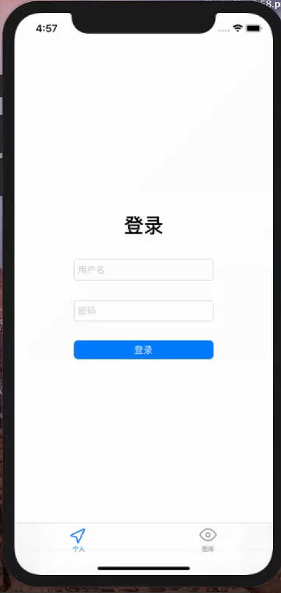
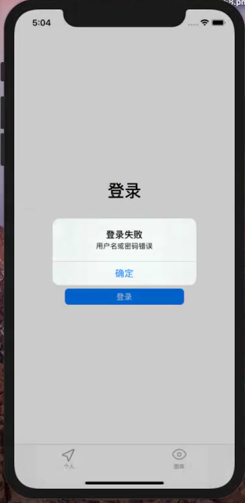
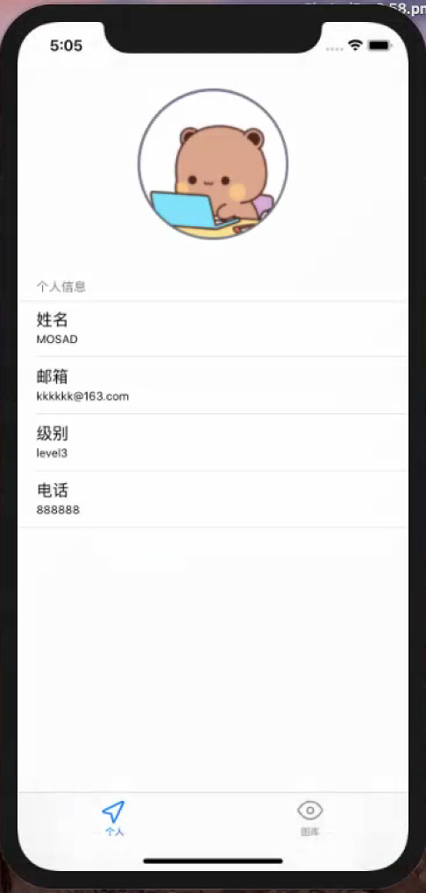
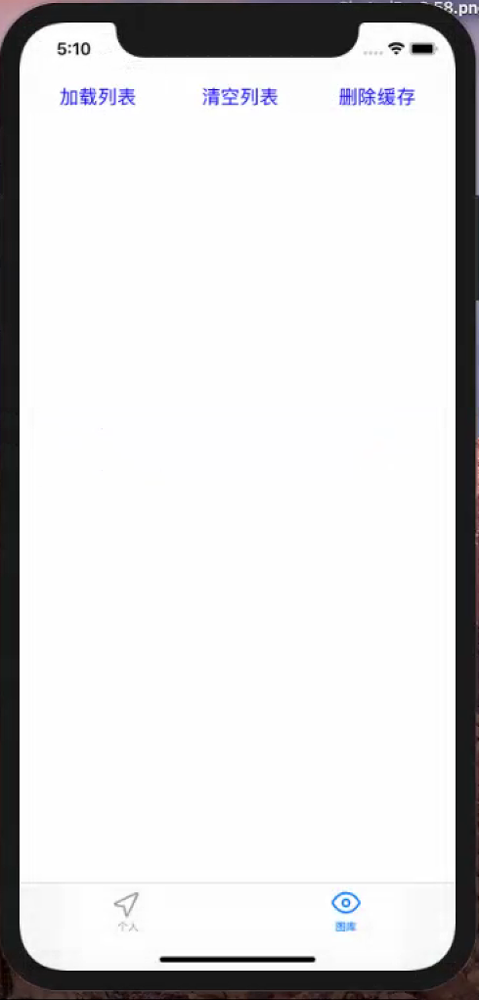
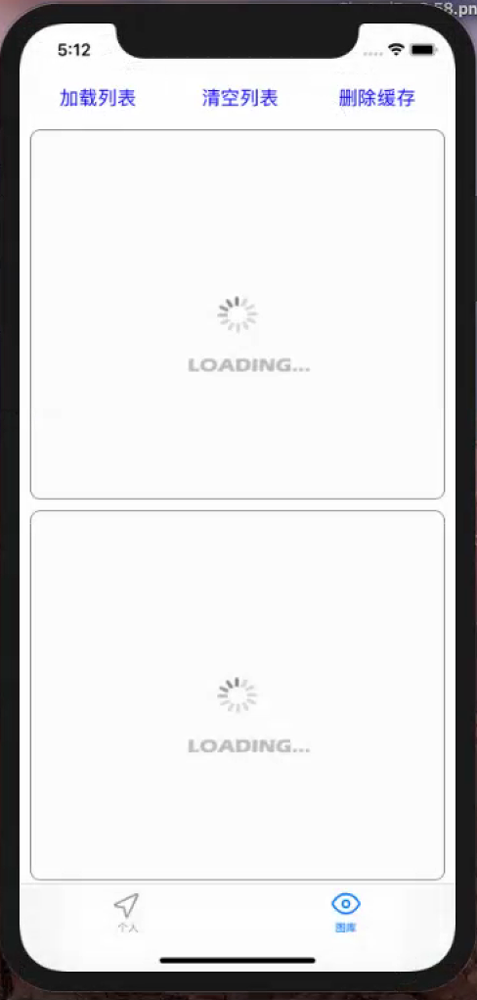
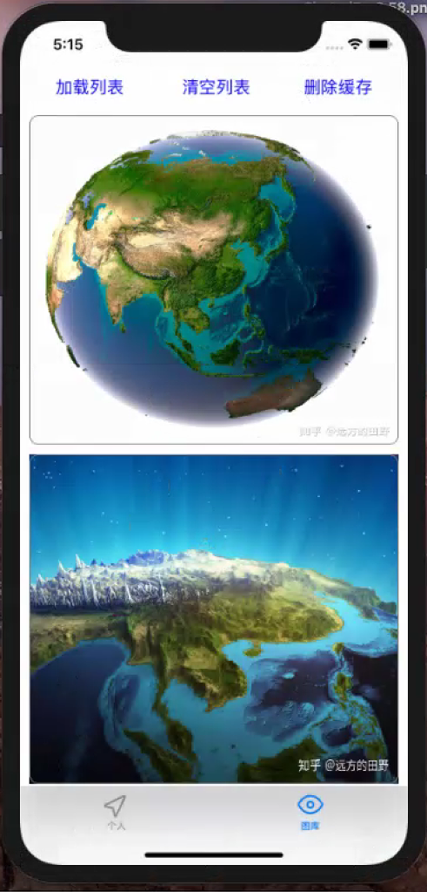

# 中山大学数据科学与计算机学院本科生实验报告
## （2020年秋季学期）
| 课程名称 | IOS现代操作系统应用开发 |   任课老师   |       郑贵锋       |
| :------: | :---------------------: | :----------: | :----------------: |
|   年级   |         2018级          | 专业（方向） |    软件工程专业    |
|   学号   |        18342069         |     姓名     |       罗炜乐       |
|   电话   |       18027303477       |    Email     | luowle@foxmail.com |
| 开始日期 |       2020.12.10        |   完成日期   |     2020.12.11     |

---

## 一、实验题目
网络访问和本地存储

---

## 二、实现内容
实现一个简单的图片浏览应用，有两个页面

1. 用户页面，首先要通过用户名和密码进行登录，然后展示用户的基本信息。
2. 图片浏览页面，包含一个Label，一个图片列表（可以用`UICollectionView`或`UITableView`），以及三个按钮（"加载" "清空" "删除缓存"）。
   - 点击"加载"按钮，若Cache中没有缓存的文件，则加载网络图片并显示在图片列表中，要求：图片下载完成前，显示loading图标；图片下载后，存入沙盒的Cache中。
   - 点击"加载"按钮，若Cache中已存在图片文件，则直接从Cache中读取出图片并显示。
   - 点击"清空"按钮，清空图片列表中的所有图片。
   - 点击"删除缓存"按钮，删除存储在Cache中的图片文件。
3. 用户个人信息的获取通过访问网络API实现。

---

## 三、实验结果
### 实验截图
#### 页面效果如下：

|                           登陆页面                           |                           登陆失败                           |                           登陆成功                           |                           清空列表                           |                           加载图片                           |                           加载成功                           |
| :----------------------------------------------------------: | :----------------------------------------------------------: | :----------------------------------------------------------: | :----------------------------------------------------------: | :----------------------------------------------------------: | :----------------------------------------------------------: |
|  |  |  |  |  |  |

### 实验步骤以及关键代码

1. 网络请求使用了异步请求，使得在请求的过程中页面不会卡住。请求请求获取图片的代码如下。其余像登陆的 `POST` ，获得用户信息、获取图片的 `GET` 方法实现方式与下面的代码大同小异，故不重复展示。

    ```objc
    -(void)loadThumb:(NSString*)url withView:(UIImageView*) view {
        NSURLSession * session = [NSURLSession sharedSession];
        NSString *urlString = url;
        urlString=[urlString stringByAddingPercentEncodingWithAllowedCharacters:[NSCharacterSet URLQueryAllowedCharacterSet]];
        NSMutableURLRequest *request = [[NSMutableURLRequest alloc] init];
        [request setURL:[NSURL URLWithString:urlString]];
        [request setHTTPMethod:@"GET"];
        NSURLSessionDataTask *task = [session dataTaskWithRequest:request completionHandler:^(NSData * _Nullable data, NSURLResponse * _Nullable response, NSError * _Nullable error) {
            dispatch_async(dispatch_get_main_queue(), ^{
                [data writeToFile:CachedImageFile(url) atomically:YES];
                view.image = [[UIImage alloc] initWithData:data];
            });
        }];
        [task resume];
    }
    ```

2.  使用沙盒对已经下载的图片进行缓存，核心代码如下。下面这段代码与上面的代码结合，可以看出，在设置图片前，会查询图片是否已经在缓存中。如果在缓存中，则直接从缓存中获取。如果不在缓存中，则使用上面的方法进行下载。上面的方法是异步的，如果下载时仍然可以操作页面，下载完成后则将其添加到缓存中并设置图片。

    ```objc
    #define CachedImageFile(url) [[NSSearchPathForDirectoriesInDomains(NSCachesDirectory, NSUserDomainMask, YES) lastObject] stringByAppendingPathComponent:[url lastPathComponent]]
    
    - (nonnull __kindof UICollectionViewCell *)collectionView:(nonnull UICollectionView *)collectionView cellForItemAtIndexPath:(nonnull NSIndexPath *)indexPath {
        //PublicItemModel* model = self.data[indexPath.row];
        UICollectionViewCell *cell = [self.collection dequeueReusableCellWithReuseIdentifier:@"cell" forIndexPath:indexPath];// initWithData:model];
        
        cell.layer.borderColor = [UIColor grayColor].CGColor;
        cell.layer.borderWidth = 1.0;
        cell.layer.cornerRadius = 10.0;
        
        UIImageView *image = [[UIImageView alloc] initWithFrame:CGRectMake(0, 0, self.view.bounds.size.width - 20, 350)];
        // 获得url对于的沙盒缓存路径
        NSString *file = CachedImageFile(_photoURL[indexPath.item]);
        // 先从沙盒中取出图片
        NSData *data = [NSData dataWithContentsOfFile:file];
        [cell addSubview:image];
        if (data) {
            //data不为空，说明沙盒中存在这个文件
            image.image = [[UIImage alloc] initWithData:data];
    
        } else {
            image.image = [UIImage imageNamed:@"timg.gif"];
            [self loadThumb:_photoURL[indexPath.item] withView:image];
        }
    
        return cell;
    }
    ```

3.   加载列表和清空列表，实现很简单，更改`Section`里`Items`的个数，并重新 `reload`整个`UICollection`。

    ```objc
    - (NSInteger)collectionView:(nonnull UICollectionView *)collectionView numberOfItemsInSection:(NSInteger)section {
        return _isClear ? 0 : 6;
    }
    
    -(void)loadBtnClick:(UIButton*)sender{
        _isClear = false;
        [_collection reloadData];
        [_collection refreshControl];
    }
    ```

4.  删除缓存

    ```objc
    - (void)clearFile {
        NSString * cachePath = [NSSearchPathForDirectoriesInDomains(NSCachesDirectory, NSUserDomainMask, YES) firstObject];
        NSArray * files = [[NSFileManager defaultManager ] subpathsAtPath :cachePath];
        
        for ( NSString * p in files) {
            
            NSError * error = nil ;
            //获取文件全路径
            NSString * fileAbsolutePath = [cachePath stringByAppendingPathComponent :p];
            
            if ([[NSFileManager defaultManager] fileExistsAtPath:fileAbsolutePath]) {
                [[NSFileManager defaultManager] removeItemAtPath:fileAbsolutePath error:&error];
            }
        }
    }
    ```

### 实验遇到的困难以及解决思路

- 原本加载动画想用`UIActivityIndicatorView`，但是不知为何该加载动画我无法让他在多个`Items`里同时加载。解决方法：放弃使用`UIActivityIndicatorView`，一开始直接选择一个加载图片，待加载完成后，再在回调函数里更改图片样式。
- 在我所处的网络环境中，无法使用校园网的 `API` 。解决方法：利用一个树莓派和花生壳将老师和TA所提供的 `API` 映射在公网上，方便自己和其他同学使用。因此可以看到，代码里的 `URL` 是 `http://luowle.imdo.co:25101` 而不是 `http://172.18.176.202:3333`。

---

## 四、实验思考及感想

1. 本次实验让我对`ObjC`的网络和存储更加熟悉，让我对自己平时每天都在使用的应用有一个了解与认识。
2. 本次实验同时使用了 `UITableView`和`UICollectionView`，让我对这两个类型有更好的区分和了解。
3. 虽然不在校园网内，但解决了访问`API`问题，让我觉得计算机网络很有趣。