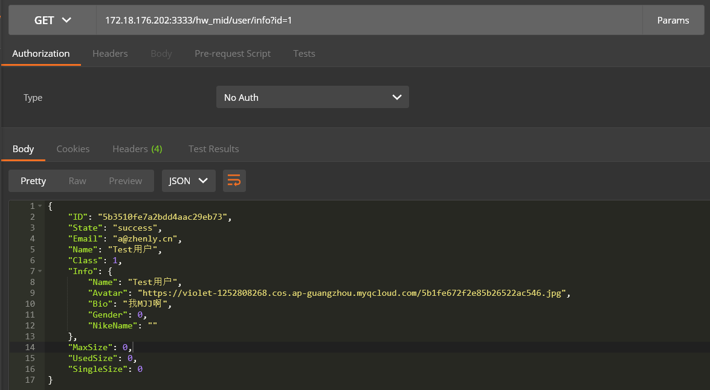

# 期中项目 --校园社交App

## 项目内容
* 运用综合知识编写功能比较完善的Feeds信息流校园资讯App
* **2020.11.20前完成所有功能开发**

---

## 提交内容

### 小组提交（每组一份）
* 完整工程源码
* 小组实验报告
* 用户使用手册

### 个人提交（每人一份）
* 个人实验报告

---

## 评分标准
* 功能实现与所用技术 【50%】
* 布局设计和动画效果 【30%】
* 文档 【20%】
* 个人成绩根据小组成绩以及贡献度百分比给分

---

## 主题：校园社交App
### 前端功能模块
|功能模块|子模块|
|:---:|:---:|
|个人主页|**增删改** 个人账号下的不同分类下的内容|
||查看其他人的不同分类的公开内容|
||快速搜索内容|
||
|广场|按照时间流查看（关注/热门）的公开内容|
||对内容进行点赞|
||对内容进行评论|
||对评论进行回复|
||下载或收藏其他人的公开内容|
||在线浏览高清图片|
|||
|设置中心|查看和管理个人信息和成就|
||查看（系统/私信/评论/点赞/回复）的通知|
||管理个人的存储额度|
||管理系统中的用户（管理员页面）|
||各种个性化设置|
### API
* 172.18.176.202:3333/hw_mid/
* 具体接口查看API文档
* example：

---

## 技术要求
**根据项目需要选择，生硬堆砌技术不加分**
* 基础UI控件布局与交互
* 界面动画实现
* 异步网络请求
* 前端与客户端交互：JSBridge
* ····
---

## 文档要求
### 文档
* 小组报告
* 个人报告
* 用户使用手册（应用使用说明）
---
### 小组报告说明
* 封面（组员，应用名，logo等信息）
* 程序运行界面截图
* 所采用的技术和采用该技术的原因（不要大段贴代码，关键部分即可）
* 成员贡献表和Git提交记录
* 应用部署方法
* 应用测试结果（成员自测，压力测试，代码覆盖率等）
可根据上表增改条目。要求是TA看完后能知道这应用做了什么以及怎么做的和为什么这么做，**不需要大段的贴代码**

---

### 个人报告说明
* 主要是个人贡献部分。
* 个人完成的功能截图与代码，最好不要出现两个人贴了同一段代码的情况。
* 遇到的问题与解决方案
* 个人总结与个人贡献评分
* 思想感悟
* 文档书写整理，需求分析设计，程序的测试工具与方法等均可归入个人贡献中。

---

## 小组项目提交方式
1.  组长将期末项目fork到自己所在小组的仓库下，如图所示；
    
2.  在小组项目中，组长分别在code、report目录下新建目录，目录名为“Group+组号”，例如“Group1”；
3.  组员fork小组项目到个人仓库下，然后clone到本地目录，在“code\Group组号”目录下，新建iOS项目，按分工编写程序，注意.gitignore的编写，避免添加不必要的中间文件、临时文件到git中；
4.  实验报告按给出的模版(manual中的report_template.md)的内容要求，以md的格式，写在“report\Group组号\12345678WangXiaoMing”目录下，结果截图也放在该目录下；
5.  项目完成时，组员Pull Request回小组项目的master分支，组长再Pull Request回主项目的master分支；
6.  组长Pull Request时，请确保“code\Group组号”目录下的iOS项目是可执行的，“report\Group组号”含所有项目文档（实验报告、用户说明文档、小组分工）及视频
7.  建议组员Pull Request时，不要Pull Request配置文件，避免配置文件随意被覆盖，导致最终项目无法运行；

