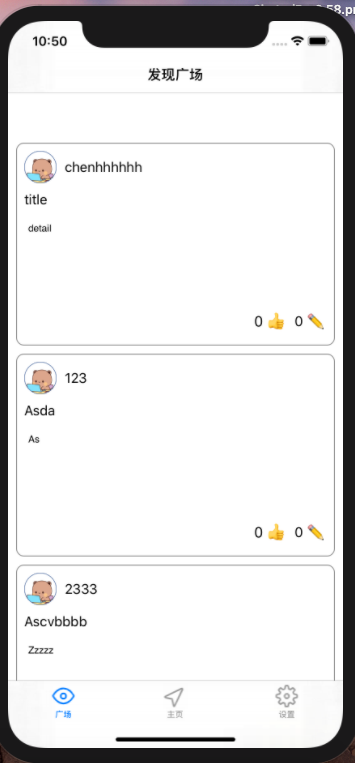
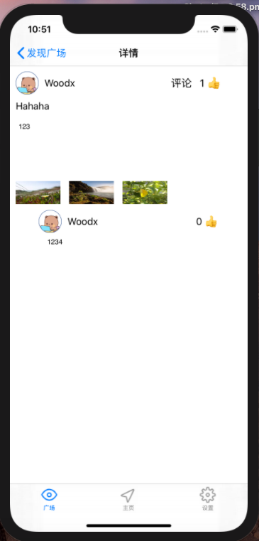
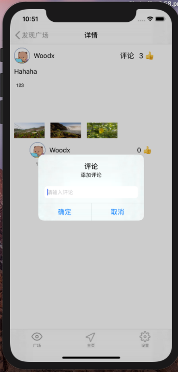
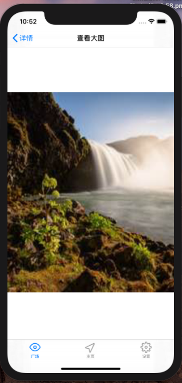
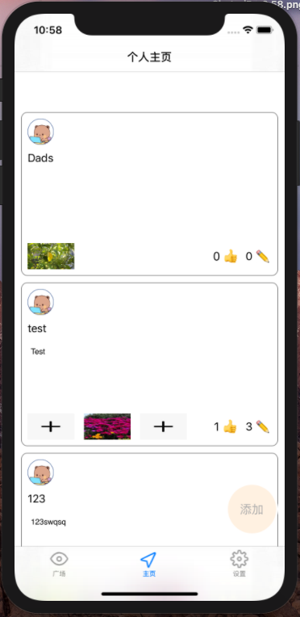
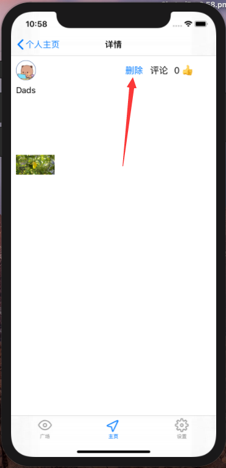
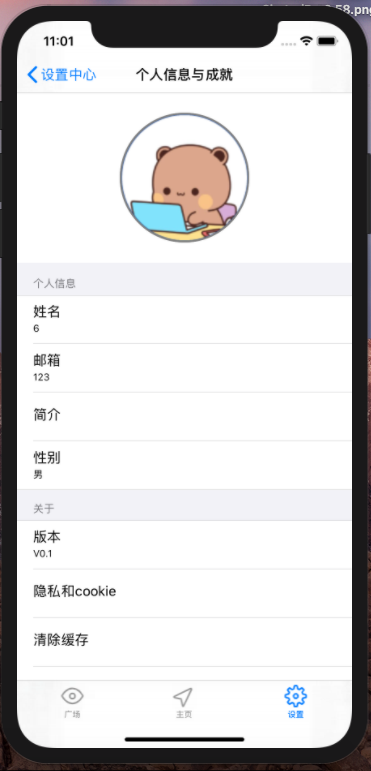
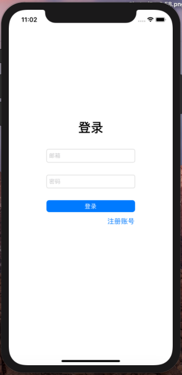

# Group11 小组报告

| 课程名称 | IOS现代操作系统应用开发 | 任课老师     | 郑贵锋   |
| -------- | ----------------------- | ------------ | -------- |
| 年级     | 2018级                  | 专业（方向） | 软件工程 |
| 成员     | 罗炜乐                  | 学号         | 18342069 |
| 成员     | 贺恩泽                  | 学号         | 17364025 |
| 成员     | 陈志远                  | 学号         | 17338020 |
| 成员     | 邵文凯                  | 学号         | 18342085 |

## 程序运行界面截图

|                         发现广场主页                         |                           页面详情                           |                           评论功能                           |                        成功点赞和评论                        |                           查看大图                           |
| :----------------------------------------------------------: | :----------------------------------------------------------: | :----------------------------------------------------------: | :----------------------------------------------------------: | :----------------------------------------------------------: |
|  |  |  |  |  |

|                           个人主页                           |                           添加打卡                           |                           删除打卡                           | 设置页面                                                     |                           查看通知                           |
| :----------------------------------------------------------: | :----------------------------------------------------------: | :----------------------------------------------------------: | ------------------------------------------------------------ | :----------------------------------------------------------: |
|  |  |  |  |  |

|                           个人信息                           |                           修改信息                           |                           存储额度                           |                           登陆页面                           |                           注册页面                           |
| :----------------------------------------------------------: | :----------------------------------------------------------: | :----------------------------------------------------------: | :----------------------------------------------------------: | :----------------------------------------------------------: |
|  |  |  |  |  |


## 所采用的技术和采用该技术的原因（不要大段贴代码，关键部分即可）

1. `Swift` 和 `Objective-C` 混合编程。原因：在上面存储额度界面发现 `Swift`的 `Charts` 很炫酷，可以深度定制，表盘还可以转圈圈，于是使用 `Pods` 安装了该库并生成手动桥接文件使用该库。

2. 网络异步请求功能。原因：如果网络是同步请求则会整个页面卡住，因此使用其他的线程进行网络请求，请求完成后再切换主线程进行 UI 的重新载入。其中一个例子如下：

    更名确认按钮，9-15行为网络请求，传入一个回调函数，使得请求完成后调度到主线程进行页面的刷新。

    ```objc
    - (void)Click:(NSString *)msg {
      
      UIAlertController *alertController = [UIAlertController alertControllerWithTitle:@"提示" message:msg preferredStyle:UIAlertControllerStyleAlert];
      //增加确定按钮；
        [alertController addAction:[UIAlertAction actionWithTitle:@"确定" style:UIAlertActionStyleDefault handler:^(UIAlertAction * _Nonnull action) {
            //获取第1个输入框；
            UITextField *userNameTextField = alertController.textFields.firstObject;
            NSLog(@"%@",userNameTextField.text);
            [AppDelegate updateName:userNameTextField.text withCallback:^{
                [self.info.tableView reloadData];
                [self.info.tableView refreshControl];
                [self.father.tableView reloadData];
                [self.father.tableView refreshControl];
            }];
        }]];
    
        //增加取消按钮；
        [alertController addAction:[UIAlertAction actionWithTitle:@"取消" style:UIAlertActionStyleDefault handler:nil]];
    
        //定义第一个输入框；
        [alertController addTextFieldWithConfigurationHandler:^(UITextField * _Nonnull textField) {
            textField.placeholder = @"请输入新姓名";
        }];
      
      [self presentViewController:alertController animated:true completion:nil];
      
    }
    ```

    异步网络请求的实现：

    ```objc
    +(void)updateName:(NSString*)name withCallback:(void (^)(void))callback {
        NSURLSession * session = [NSURLSession sharedSession];
        NSString *urlString = [NSString stringWithFormat:@"http://172.18.178.56/api/user/name"];
        urlString=[urlString stringByAddingPercentEncodingWithAllowedCharacters:[NSCharacterSet URLQueryAllowedCharacterSet]];
        NSMutableURLRequest *request = [[NSMutableURLRequest alloc] init];
        [request setURL:[NSURL URLWithString:urlString]];
        [request setHTTPMethod:@"POST"];
        NSMutableDictionary* data = [[NSMutableDictionary alloc] init];
        [data setObject:name forKey:@"name"];
        NSData* json = [NSJSONSerialization dataWithJSONObject:data options:NSJSONWritingSortedKeys error:nil];
        [request setHTTPBody:json];
        [request setValue:@"application/json" forHTTPHeaderField:@"Content-Type"];
        [request setValue:@"application/json" forHTTPHeaderField:@"Accept"];
        NSURLSessionDataTask *task = [session dataTaskWithRequest:request completionHandler:^(NSData * _Nullable data, NSURLResponse * _Nullable response, NSError * _Nullable error) {
            NSString * str = [[NSString alloc]initWithData:data encoding:NSUTF8StringEncoding];
            NSLog(@"%@", str);
            [self getUserData:callback];
        }];
        [task resume];
    }
    ```

3.  同时使用 `Xib` 和代码完成界面。原因：`Xib` 编写 UI 简洁大方效率高，代码编写 UI 的团队协作好。根据不同页面不同写作方式发挥其优点。

4. JSON 解析。原因：网络请求和响应体均为 JSON 格式，因此采用 `NSJSONSerialization` 对 JSON 进行序列化和反序列化，这个过程通过和 `NSDictionary` 的交互来完成。

    例如在对用户的个人信息进行解析时，采用了如下的实现对响应进行解析：
    ```objc
    NSURLSessionDataTask *task = [session dataTaskWithRequest:request completionHandler:^(NSData * _Nullable data, NSURLResponse * _Nullable response, NSError * _Nullable error) {
        NSDictionary *dic = [NSJSONSerialization JSONObjectWithData:data options:NSJSONReadingMutableLeaves error:nil];
        NSString* state = [dic objectForKey:@"State"];
        if (![state isEqualToString:@"success"]) {
            [AppDelegate setUserModel:nil];
            return;
        }
        UserModel *model = [[UserModel alloc] init];
        model.Id = [dic objectForKey:@"ID"];
        model.State = state;
        model.Email = [dic objectForKey:@"Email"];
        model.Name = [dic objectForKey:@"Name"];
        model.Class = [[dic objectForKey:@"Class"] integerValue];
        model.MaxSize = [[dic objectForKey:@"MaxSize"] integerValue];
        model.UsedSize = [[dic objectForKey:@"UsedSize"] integerValue];
        model.SingleSize = [[dic objectForKey:@"SingleSize"] integerValue];
        model.Info = [[UserInfo alloc] init];
        NSDictionary *infodic = [dic objectForKey:@"Info"];
        model.Info.Name = [infodic objectForKey:@"Name"];
        model.Info.Avatar = [infodic objectForKey:@"Avatar"];
        model.Info.Bio = [infodic objectForKey:@"Bio"];
        model.Info.Gender = [[infodic objectForKey:@"Gender"] integerValue];
        
        [AppDelegate setUserModel:model];
        dispatch_async(dispatch_get_main_queue(), callback);
        
    }];
    [task resume];
    ```

## 成员贡献表和Git提交记录

| 罗炜乐(冬青) | 陈志远(decorunchen，18819841512)![decorunchen](data:image/png;base64,iVBORw0KGgoAAAANSUhEUgAAAEsAAABLCAYAAAA4TnrqAAADlElEQVR4Xu3YW0hTcRwH8O9smeaFaS3D0kgzoyzNLkgk1EMUkfiQEb1HT732UiARvdVjEF0o6MUsgjATskK7LCsvlcu1mTq2mZqZ5mXq3OXEOabl8nJ+O7t44LfXfc+f8/vsey77a26cqBLAH1kCGsaS5SSFGEu+FWMRrBiLsSgChCzfsxiLIECIcrMYiyBAiHKzGIsgQIhysxiLIECIcrMYiyBAiHKzGIsgQIhysxiLIECIcrMYiyBAiHKzGIsgQIiGrVk7jmUhtygDUdooeacnAJ4JL1xON/rtw2gzdKHd0CXv2BClFi+W/8ACMPjdieaKDlhqO0PEMf+y6sH6M4fYtpYnNtSXWcIOFjEs67se2Jp65xxYlxoHXWo8ktMTkKCPhSZKM531un0wVlnRUN4aVrCIYYmX0qvrRlnDZu9bi/ySLMQlx0znXSNuvLndgva6bllrBCOkCixx0LQ8PfaezJkB1mMeQOWFt8FwkLWGarDEabYcWoddx7OhXbZEGs497kV9mRmmp3ZZwyoNqQpLHPbgmZ1I266fnFuAdBnWXPmo1EHW8arD2laUgfyjG6CNnmzXQOcIKkrr4B73yBpYSUh1WKs3JWH/6bzpe9fY0IT0oLDP82RVAvTvsarDEk++5FIhdGvipTk8Li/el1lgqrYFy2TOdVSJdfjsbqTmrJCG8nl8+PSoA433vzLWbAL+WM2VVjTcC/0LquqbJT4RzTUOvL75mZslp1l8Gc7Tk6LzBUjZmMT3rIWupaUxWhRf3APxj/bUW3zdHRNaw7Bto7p7Vnr+KhSe2orYxGgJa/SXCy+uNuObsW8hZ8Xfqw7Lf8e1zzqEh+cMiiHkLKA6rCOlBRDf4qW/hoIA83MHDLda5MyqOKMqLP9dh7FBF15eM8Lx8YdiCDkLqAbrv/0sAbB/6EX15UY5cwYlowqszQfSkVucOWPjz9k/Lr2IhqtVonbEsBbag1+5PhGJKcuhz9QhNiEa+LsFj4lRN+rvtuLLs/Bs+k3VMmJYgV4X4r6V8bEVTQ/aAl0i4ONUgyX4BPy0DaOh3ILO5tC/U80mumixRBxxr8o54EJfxyAstQ50m/oDbkUwDgwbVjBONtJrMBbhF2AsxiIIEKLcLMYiCBCi3CzGIggQotwsxiIIEKLcLMYiCBCi3CzGIggQotwsxiIIEKLcLMYiCBCi3CzGIggQotwsxiIIEKLcLMYiCBCivwFnw0DtUiG9wQAAAABJRU5ErkJggg==) | 贺恩泽(hez2010) | 邵文凯 |
| :----------------------------------------------------------: | :----------------------------------------------------------: | :----------------------------------------------------------: | :----: |
| 1.设置页面 2.个人信息页面 3.存储额度页面 4.登录页面 5.注册页面 6.点赞功能 7.更名功能 |        1.个人空间页面 2.输入内容页面 3.发布内容页面        | 1.通知页面 2.发现广场页面 3.详情页面 4.评论功能 5.网络请求功能 6.查看大图功能 7.内容删除功能 |        |


## 应用部署方法

使用 `Xcode 11.7` 部署在 `iPhone 11` 模拟器上。

## 应用测试结果

部署应用到模拟器上后进行测试，按照 [程序运行界面截图] 节依次进行功能测试，所有功能均正常运行。
