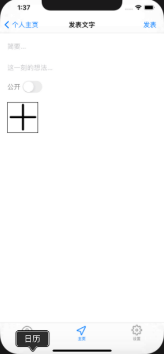

# 中山大学数据科学与计算机学院本科生实验报告
## （2020年秋季学期）
| 课程名称 | IOS现代操作系统应用开发 | 任课老师 | 郑贵锋 |
| :------------: | :-------------: | :------------: | :-------------: |
| 年级 | 2018级 | 专业（方向） | 软件工程专业 |
| 学号 | 17338020 | 姓名 | 陈志远 |
| 电话 | 18819842512 | Email |chenzhy93@mail2.sysu.edu.cn|
| 开始日期 | 2020.11 | 完成日期 | 2020.12|

---

## 一、实验题目
## 期中项目 -- 校园社交App

---

## 二、实现内容
### 本人负责的应用的实现部分：

- 个人空间页面
- 输入内容页面
- 发布界面页面
- 等等

---

## 三、实验结果
### (1)实验截图
#### 我负责设计编写的页面效果如下：
  

  

  

### (2)实验步骤以及关键代码
#### 个人空间界面
主要是关于 UICollectionView 的编写，以及网络编程 GET 信息的获取
```objc
//加载信息
- (void)loadData {
    NSURLSession * session = [NSURLSession sharedSession];
    NSString *urlString = @"http://172.18.178.56/api/content/album/self";
    urlString=[urlString stringByAddingPercentEncodingWithAllowedCharacters:[NSCharacterSet URLQueryAllowedCharacterSet]];
    NSMutableURLRequest *request = [[NSMutableURLRequest alloc] init];
    [request setURL:[NSURL URLWithString:urlString]];
    [request setHTTPMethod:@"GET"];
    NSURLSessionDataTask *task = [session dataTaskWithRequest:request completionHandler:^(NSData * _Nullable data, NSURLResponse * _Nullable response, NSError * _Nullable error) {
        NSDictionary *dic = [NSJSONSerialization JSONObjectWithData:data options:NSJSONReadingMutableLeaves error:nil];
        NSString* state = [dic objectForKey:@"State"];
        if (![state isEqualToString:@"success"]) {
            return;
        }
        NSArray* items = [dic objectForKey:@"Data"];
        
        for (int i = 0; i < items.count; i++) {
            PublicItemModel *model = [[PublicItemModel alloc] init];
            NSDictionary* itemData = items[i];
            model.Data = [[PublicContentModel alloc] init];
            model.User = [[PublicItemUserModel alloc] init];
            model.Data.Id = [itemData objectForKey:@"ID"];
            model.Data.Name = [itemData objectForKey:@"Name"];
            model.Data.Detail = [itemData objectForKey:@"Detail"];
            model.Data.OwnId = [itemData objectForKey:@"OwnID"];
            model.Data.PublishDate = [[NSDate alloc] initWithTimeIntervalSince1970:[[itemData objectForKey:@"PublishDate"] integerValue]];
            model.Data.EditDate = [[NSDate alloc] initWithTimeIntervalSince1970:[[itemData objectForKey:@"EditDate"] integerValue]];
            model.Data.LikeNum = [[itemData objectForKey:@"LikeNum"] integerValue];
            model.Data.CommentNum = [[itemData objectForKey:@"CommentNum"] integerValue];
            model.Data.Public = [[itemData objectForKey:@"Public"] boolValue];
            model.Data.Native = [[itemData objectForKey:@"Native"] boolValue];
            model.Data.Type = [itemData objectForKey:@"Type"];
            model.Data.Tag = [itemData objectForKey:@"Tag"];
            model.Data.Image = [itemData objectForKey:@"Image"];
            model.Data.Files = [itemData objectForKey:@"Files"];
            model.Data.Movie = [itemData objectForKey:@"Movie"];
            model.Data.Album = [[PublicContentAlbumModel alloc] init];
            NSDictionary* album = [itemData objectForKey:@"Album"];
            model.Data.Album.Time =[[NSDate alloc] initWithTimeIntervalSince1970:[[album objectForKey:@"Time"] integerValue]];
            model.Data.Album.Location =[album objectForKey:@"Location"];
            model.Data.Album.Title =[album objectForKey:@"Title"];
            
            NSArray *imageArray = [album objectForKey:@"Images"];
            NSMutableArray *array = [[NSMutableArray alloc] init];
            for (int j = 0; j < imageArray.count; j++) {
                PublicContentImageModel *imageModel = [[PublicContentImageModel alloc] init];
                imageModel.Native = [[imageArray[j] objectForKey:@"Native"] boolValue];
                imageModel.Thumb = [imageArray[j] objectForKey:@"Thumb"];
                imageModel.Url = [imageArray[j] objectForKey:@"URL"];
                NSDictionary *file = [imageArray[j] objectForKey:@"File"];
                imageModel.File = [[PublicContentFileModel alloc] init];
                imageModel.File.File = [[file objectForKey:@"File"] stringByReplacingOccurrencesOfString:@"/" withString:@"|"];
                imageModel.File.Count = [[file objectForKey:@"Count"] integerValue];
                imageModel.File.Size = [[file objectForKey:@"Size"] integerValue];
                imageModel.File.Title = [file objectForKey:@"Title"];
                imageModel.File.Type = [file objectForKey:@"Type"];
                imageModel.File.Time =[[NSDate alloc] initWithTimeIntervalSince1970:[[file objectForKey:@"Time"] integerValue]];
                [array addObject:imageModel];
            }
            model.Data.Album.Images = array;
            
            [self.data addObject:model];
        }
        
        dispatch_async(dispatch_get_main_queue(), ^{
            [self reloadData];
        });
        
    }];
    [task resume];
}
```

#### 自定义 UICollectionViewCell
自定义是囊括了文本内容和图片的显示位置。  

```objc
@implementation MineTextCell

- (instancetype)initWithStyle:(UITableViewCellStyle)style reuseIdentifier:(NSString *)reuseIdentifier {
    self = [super initWithStyle:style reuseIdentifier:reuseIdentifier];
    if (self) {
        [self initSubView];
    }
    return self;
}

- (void)setFrame:(CGRect)frame {
    frame.origin.x += 10;
    frame.origin.y += 10;
    frame.size.width -= 20;
    frame.size.height -= 10;
    [super setFrame:frame];
}

- (void)initSubView {
    self.backgroundColor = [UIColor colorWithRed:(float)248 / 255.0f green:(float)248 / 255.0f blue:(float)255 / 255.0f alpha:0.5];
    
    self.title = [[UILabel alloc] init];
    [self.title setFrame:CGRectMake(10, 5, 150, 20)];
    self.title.backgroundColor = [UIColor clearColor];
    self.title.font = [UIFont systemFontOfSize:18];
    self.title.textColor = [UIColor colorWithRed:(float)205 / 255.0f green:(float)92 / 255.0f blue:(float)92 / 255.0f alpha:0.7];
    [self addSubview:self.title];
    
    self.etime = [[UILabel alloc] init];
    [self.etime setFrame:CGRectMake(10, 28, 150, 20)];
    self.etime.backgroundColor = [UIColor clearColor];
    self.etime.font = [UIFont systemFontOfSize:16];
    [self addSubview:self.etime];
    
    self.text = [[UILabel alloc]init];
    [self.text setFrame:CGRectMake(20, 50, 200, 40)];
    self.text.backgroundColor = [UIColor clearColor];
    self.text.font = [UIFont systemFontOfSize:18];
    [self addSubview:self.text];
    
    self.pub = [[UILabel alloc] init];
    [self.pub setFrame:CGRectMake(163, 5, 40, 20)];
    self.pub.backgroundColor = [UIColor clearColor];
    self.pub.font = [UIFont systemFontOfSize:14];
    [self addSubview:self.pub];
}

@end
```

#### 输入内容界面
界面大致与 HW2 相似，选择照片以及输入内容，只是增加了网络编程的 POST 内容。  

```objc
- (void)setInfo {
    self.titleIn = [[UITextField alloc] initWithFrame:CGRectMake(20, 100, wlen - 40, 50)];
    self.titleIn.placeholder = @"简要...";
    [self.view addSubview:self.titleIn];
    self.input = [[UITextField alloc] initWithFrame:CGRectMake(20, 155, wlen - 40, 50)];
    self.input.placeholder = @"这一刻的想法...";
    [self.view addSubview:self.input];
    
    self.addbtn = [[UIButton alloc]init];
    self.addbtn.frame = CGRectMake(20, 270, 80, 80);
    self.addbtn.backgroundColor = [UIColor whiteColor];
    [self.addbtn setBackgroundImage:[UIImage imageNamed:@"add.png"] forState:UIControlStateNormal];
    self.addbtn.layer.borderColor = [UIColor blackColor].CGColor;
    self.addbtn.layer.borderWidth = 1.0;
    [self.addbtn addTarget:self action:@selector(selectImages:) forControlEvents:UIControlEventTouchUpInside];
    [self.view addSubview:self.addbtn];
    
    UIBarButtonItem *btn = [[UIBarButtonItem alloc] initWithTitle:@"发表" style:UIBarButtonItemStylePlain target:self action:@selector(publish:)];
    self.navigationItem.rightBarButtonItem = btn;
}

- (void)publish:(UIBarButtonItem*)btn {
    NSString *text = self.input.text;
    NSString *title = self.titleIn.text;
    NSObject *isp = [[NSObject alloc] init];
    if ([self.mySwitch isOn]) {
        isp = @YES;
        NSLog(@"on");
    } else {
        isp = @NO;
    }

    NSMutableDictionary *params = [[NSMutableDictionary alloc] init];
    [params setObject:title forKey:@"title"];
    [params setObject:text forKey:@"detail"];
    [params setObject:isp forKey:@"isPublic"];

    AFHTTPSessionManager *manager = [AFHTTPSessionManager manager];
    manager.responseSerializer = [AFHTTPResponseSerializer serializer];
    [manager POST:@"http://172.18.178.56/api/content/album" parameters:params headers:nil constructingBodyWithBlock:^(id<AFMultipartFormData>  _Nonnull formData) {
        for(int i = 0; i < self.images.count;i++){
            UIImage *imgtmp = self.images[i];
            NSData *imgData = UIImageJPEGRepresentation(imgtmp, 0.4);
            NSString *fileKey = [NSString stringWithFormat:@"file%d", (i + 1)];
            NSString *thumbKey = [NSString stringWithFormat:@"thumb%d", (i + 1)];
            [formData appendPartWithFileData:imgData name:fileKey fileName:fileKey mimeType:@"image/png"];
            [formData appendPartWithFileData:imgData name:thumbKey fileName:thumbKey mimeType:@"image/png"];
        }
    } progress:^(NSProgress * _Nonnull uploadProgress) {
    
    } success:^(NSURLSessionDataTask * _Nonnull task, id  _Nullable responseObject) {
        NSLog(@"post content successfully");
        NSDictionary *JSON = [NSJSONSerialization JSONObjectWithData:responseObject options:NSJSONReadingAllowFragments error:nil];
        NSLog(@"responseObject: %@",JSON);
        dispatch_async(dispatch_get_main_queue(), ^{
            [self.navigationController popViewControllerAnimated:YES];
        });
    } failure:^(NSURLSessionDataTask * _Nullable task, NSError * _Nonnull error) {
        NSLog(@"post failed");
    }];
}
```

#### 大图的 demo 编写
```objc
-(instancetype) initWithUrl:(NSString*)url{
    if (self == nil) {
        self = [super init];
    }
    [self.navigationItem setTitle:@"查看大图"];
    [self image];
    [self loadImage:url];
    return self;
}

+(void)scanBigImageWithImage:(UIImage *)image frame:(CGRect)pOldframe {
    oldframe = pOldframe;
    //当前视图
    UIWindow *window = [UIApplication sharedApplication].keyWindow;
    //背景
    UIView *backgroundView = [[UIView alloc] initWithFrame:CGRectMake(0, 0, [UIScreen mainScreen].bounds.size.width, [UIScreen mainScreen].bounds.size.height)];
    [backgroundView setBackgroundColor:[UIColor colorWithRed:107/255.0 green:107/255.0 blue:99/255.0 alpha:0.6]];
    //此时视图不会显示
    [backgroundView setAlpha:0];
    //将所展示的imageView重新绘制在Window中
    UIImageView *imageView = [[UIImageView alloc] initWithFrame:oldframe];
    [imageView setImage:image];
    [imageView setTag:1024];
    [backgroundView addSubview:imageView];
    //将原始视图添加到背景视图中
    [window addSubview:backgroundView];
    
    //添加点击事件同样是类方法 -> 作用是再次点击回到初始大小
    UITapGestureRecognizer *tapGestureRecognizer = [[UITapGestureRecognizer alloc] initWithTarget:self action:@selector(hideImageView:)];
    [backgroundView addGestureRecognizer:tapGestureRecognizer];
    
    //动画放大所展示的ImageView
    
    [UIView animateWithDuration:0.4 animations:^{
        CGFloat y,width,height;
        y = ([UIScreen mainScreen].bounds.size.height - image.size.height * [UIScreen mainScreen].bounds.size.width / image.size.width) * 0.5;
        //宽度为屏幕宽度
        width = [UIScreen mainScreen].bounds.size.width;
        //高度 根据图片宽高比设置
        height = image.size.height * [UIScreen mainScreen].bounds.size.width / image.size.width;
        [imageView setFrame:CGRectMake(0, y, width, height)];
        //重要！ 将视图显示出来
        [backgroundView setAlpha:1];
    } completion:^(BOOL finished) {
        
    }];
    
}

+ (void)ImageZoomWithImageView:(UIImageView *)view {
    UIWindow *window = [UIApplication sharedApplication].keyWindow;
    [self scanBigImageWithImage:view.image frame:[view convertRect:view.bounds toView:window]];
}

/**
 *  恢复imageView原始尺寸
 *
 *  @param tap 点击事件
 */
+(void)hideImageView:(UITapGestureRecognizer *)tap{
    UIView *backgroundView = tap.view;
    //原始imageview
    UIImageView *imageView = [tap.view viewWithTag:1024];
    //恢复
    [UIView animateWithDuration:0.4 animations:^{
        [imageView setFrame:oldframe];
        [backgroundView setAlpha:0];
    } completion:^(BOOL finished) {
        //完成后操作->将背景视图删掉
        [backgroundView removeFromSuperview];
    }];
}
```

## 四、实验思考及感想

1. 首先因为这次是团队任务，让我锻炼了与他人的协同工作能力，也学习了小组成员的各种长处。  
2. 同时学习了网络编程相关知识。  
3. 通过本次作业，让我对之前上课讲的内容有了更加深刻的理解，能够融会贯通地使用它们完成一个 APP 的部分功能与 UI，让我收获匪浅。
4. 锻炼了我的自主学习能力。  