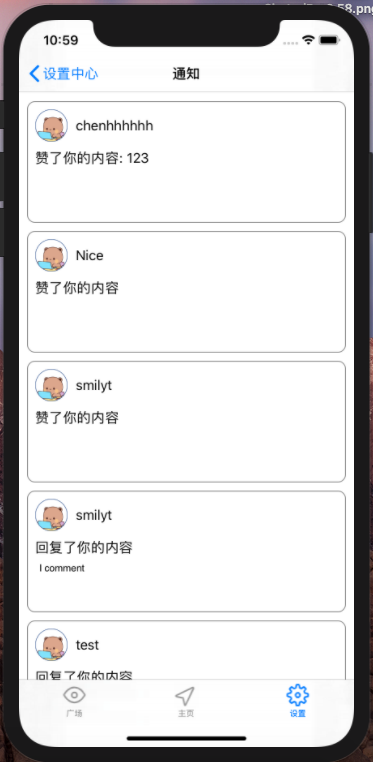
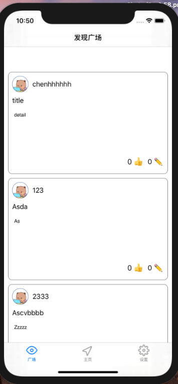
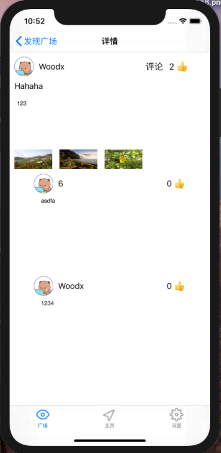
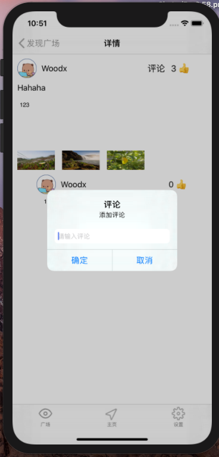
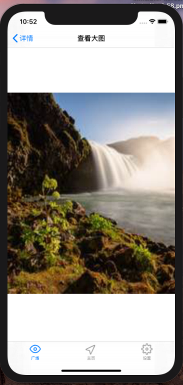
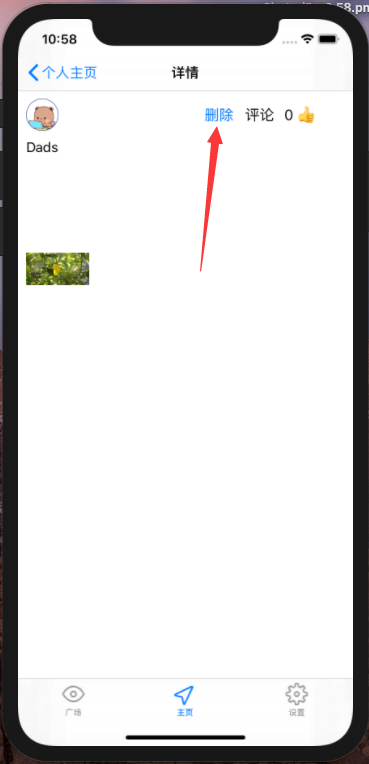

# 中山大学数据科学与计算机学院本科生实验报告
## （2020年秋季学期）
| 课程名称 | IOS现代操作系统应用开发 | 任课老师 | 郑贵锋 |
| :------------: | :-------------: | :------------: | :-------------: |
| 年级 | 2018级 | 专业（方向） | 软件工程专业 |
| 学号 | 17364025 | 姓名 | 贺恩泽 |
| 电话 | 13709283280 | Email |hez2010@outlook.com|
| 开始日期 | 2020.11 | 完成日期 | 2020.12|

---

## 一、实验题目
## 期中项目 -- 校园社交App

---

## 二、实现内容
### 本人负责的应用的实现部分：

- 通知页面
- 发现广场页面
- 详情页面
- 评论功能
- 网络请求功能
- 查看大图功能
- 内容删除功能

---

## 三、实验结果
### (1)实验截图
#### 我负责设计编写的页面效果如下：

| 通知页面 | 发现广场页面 | 详情页面 | 评论功能 | 查看大图功能 |  内容删除功能 |
| :-: | :-: | :-: | :-: | :-: | :-: |
|  |  |  |  |  |  |


### (2)实验步骤以及关键代码

#### 网络请求功能
异步网络请求流程为：构建网络请求 - 发送请求 - 处理响应 - 调度回主线程进行 UI 更新等操作，因此整理为如下代码：

```objc
// 构建请求
NSURLSession * session = [NSURLSession sharedSession];
...
NSURLSessionTask* task = [session dataTaskWithRequest:request completionHandler:^(NSData * _Nullable data, NSURLResponse * _Nullable response, NSError * _Nullable error) {
    // 处理响应
    ...
    
    // 调度回主线程进行 UI 更新等操作
    dispatch_async(dispatch_get_main_queue(), ^{
        ...
    });
}];
// 发送请求
[task resume];
```

异步网络请求的好处显而易见，请求过程中不会阻塞主线程，因此可以保证应用的流畅运行。

#### 通知页面
通知页面中，列表采用 `UICollectionView` 实现。

首先创建一个 `UICollectionView`，设置好布局并注册 cell 重用：

```objc
- (UICollectionView *)notifications {
    if (_notifications == nil) {
        UICollectionViewFlowLayout *flowLayout = [[UICollectionViewFlowLayout alloc] init];
        flowLayout.itemSize = CGSizeMake(self.view.bounds.size.width - 20, 150);
        _notifications = [[UICollectionView alloc] initWithFrame:CGRectMake(self.view.bounds.origin.x + 10, self.view.bounds.origin.y + 100, self.view.bounds.size.width - 20, self.view.bounds.size.height - 150) collectionViewLayout:flowLayout];
        [_notifications setBackgroundColor:UIColor.clearColor];
        [_notifications setDataSource:self];
        [_notifications setDelegate:self];
        [_notifications registerClass:[NotificationCellView class] forCellWithReuseIdentifier:@"cell"];
        [self.view addSubview:_notifications];
    }
    return _notifications;
}
```

对于 Cell，创建一个 `NotificationCellView` 来展示列表中的每一个 cell。该类型提供一个 `initWithData` 接收数据：


```objc
- (instancetype)initWithData:(NotificationModel*)data {
    if (self == nil) {
        self = [super init];
    }
    self.model = data;
    UIImageView* avatar = [self avatar];
    avatar.image = nil;
    [self loadAvatar:avatar withUrl:data.User.Avatar];
    [[self username] setText:data.User.Name];
    NSString* titleText = [data.Data.Type isEqualToString:@"like"] ? @"赞了你的内容" : @"回复了你的内容";
    [[self title] setText:titleText];
    [[self content] setText:data.Data.Content];
    [self getContent:data.Data.TargetId];
    return self;
}
```

请求内容和获取头像、图片等信息采用异步网络请求，请求完毕后调度到主线程上更新 UI：

```objc
- (void)getContent:(NSString*)contentId {
    // 创建网络请求
    NSURLSession * session = [NSURLSession sharedSession];
    NSString *urlString = [[NSString alloc] initWithFormat:@"http://172.18.178.56/api/content/detail/%@", contentId];
    urlString=[urlString stringByAddingPercentEncodingWithAllowedCharacters:[NSCharacterSet URLQueryAllowedCharacterSet]];
    NSMutableURLRequest *request = [[NSMutableURLRequest alloc] init];
    [request setURL:[NSURL URLWithString:urlString]];
    [request setHTTPMethod:@"GET"];
    NSURLSessionTask* task = [session dataTaskWithRequest:request completionHandler:^(NSData * _Nullable data, NSURLResponse * _Nullable response, NSError * _Nullable error) {
        NSDictionary *dic = [NSJSONSerialization JSONObjectWithData:data options:NSJSONReadingMutableLeaves error:nil];
        NSString* state = [dic objectForKey:@"State"];
        if (![state isEqualToString:@"success"]) {
            return;
        }

        PublicItemModel *model = [[PublicItemModel alloc] init];
        // 省略，反序列化 JSON
        self.contentModel = model;
        
        // 更新 UI
        dispatch_async(dispatch_get_main_queue(), ^{
            [self.title setText:[self.title.text stringByAppendingFormat:@": %@", model.Data.Name]];
        });
    }];
    // 启动网络请求
    [task resume];
}

-(void)downloadResource:(NSString*)url withCallback:(void (^)(NSData* data))callback {
    NSURLSession * session = [NSURLSession sharedSession];
    NSString *urlString = url;
    urlString=[urlString stringByAddingPercentEncodingWithAllowedCharacters:[NSCharacterSet URLQueryAllowedCharacterSet]];
    NSMutableURLRequest *request = [[NSMutableURLRequest alloc] init];
    [request setURL:[NSURL URLWithString:urlString]];
    [request setHTTPMethod:@"GET"];
    NSURLSessionDataTask *task = [session dataTaskWithRequest:request completionHandler:^(NSData * _Nullable data, NSURLResponse * _Nullable response, NSError * _Nullable error) {
        dispatch_async(dispatch_get_main_queue(), ^{
            [callback data];
        });
    }];
    [task resume];
}
```

然后将 `self.data` 用作存储数据，给通知列表提供数据，利用 Cell 重用机制减少分配，并只渲染可视范围之内的通知，然后对渲染出的通知调用 `setRead` 标记已读：

```objc
- (nonnull __kindof UICollectionViewCell *)collectionView:(nonnull UICollectionView *)collectionView cellForItemAtIndexPath:(nonnull NSIndexPath *)indexPath {
    NotificationModel* model = self.data[indexPath.row];
    NotificationCellView *cell = [[self.notifications dequeueReusableCellWithReuseIdentifier:@"cell" forIndexPath:indexPath] initWithData:model];
    
    cell.layer.borderColor = [UIColor grayColor].CGColor;
    cell.layer.borderWidth = 1.0;
    cell.layer.cornerRadius = 10.0;
    
    cell.backgroundColor = [UIColor clearColor];
    if (!model.Data.Read) {
        [self setRead:model.Data.Id];
    }
    return cell;
}

- (NSInteger)collectionView:(nonnull UICollectionView *)collectionView numberOfItemsInSection:(NSInteger)section {
    return self.data.count;
}
```

选中一项之后，获取数据后，跳转到详情页面查看：

```objc
- (void)navigateToContent:(NSString*)contentId {
    NSURLSession * session = [NSURLSession sharedSession];
    NSString *urlString = [[NSString alloc] initWithFormat:@"http://172.18.178.56/api/content/detail/%@", contentId];
    urlString=[urlString stringByAddingPercentEncodingWithAllowedCharacters:[NSCharacterSet URLQueryAllowedCharacterSet]];
    NSMutableURLRequest *request = [[NSMutableURLRequest alloc] init];
    [request setURL:[NSURL URLWithString:urlString]];
    [request setHTTPMethod:@"GET"];
    NSURLSessionTask* task = [session dataTaskWithRequest:request completionHandler:^(NSData * _Nullable data, NSURLResponse * _Nullable response, NSError * _Nullable error) {
        NSDictionary *dic = [NSJSONSerialization JSONObjectWithData:data options:NSJSONReadingMutableLeaves error:nil];
        NSString* state = [dic objectForKey:@"State"];
        if (![state isEqualToString:@"success"]) {
            return;
        }

        PublicItemModel *model = [[PublicItemModel alloc] init];
        
        // 省略，反序列化 JSON
        
        // 调度回主线程操作 UI，跳转到详情页
        dispatch_async(dispatch_get_main_queue(), ^{
            DetailViewController* detail = [[DetailViewController alloc] initWithData:model withCanDelete:YES];
            [self.navigationController pushViewController:detail animated:true];
        });
    }];
    [task resume];
}

- (void)collectionView:(UICollectionView *)collectionView didSelectItemAtIndexPath:(NSIndexPath *)indexPath {
    NotificationModel* model = self.data[indexPath.row];
    [self navigateToContent:model.Data.TargetId];
}
```

#### 发现广场页面
该页面与通知页面大体相同，只需要将数据源从通知数据换成公开内容数据即可。

#### 详情、评论、查看大图和删除内容功能
详情页面功能较为复杂，包含内容展示、评论、查看大图、点赞和删除等功能。我实现的部分为内容展示、评论、查看大图和删除功能。

详情页面包含头像、用户名、标题、内容、缩略图和评论列表等。

对于头像、用户名、标题和内容，通过 `UIImageView`、`UILabel` 和 `UITextView` 实现即可，不再赘述。

对于缩略图，采用 `UICollectionView` 实现，但是不同的是，布局需要更换为 Grid，而不是普通的列表：

```objc
- (UICollectionView *)images {
    if (_images == nil) {
        UICollectionViewFlowLayout* layout = [[UICollectionViewFlowLayout alloc] init];
        [layout setItemSize:CGSizeMake((self.view.bounds.size.width - 180) / 3, 40)];
        [layout setMinimumLineSpacing:10];
        [layout setMinimumInteritemSpacing:10];
        _images = [[UICollectionView alloc] initWithFrame:CGRectMake(10, 200, self.view.bounds.size.width - 150, (self.model.Data.Album.Images.count / 3 + (self.model.Data.Album.Images.count % 3 == 0 ? 0 : 1)) * 50) collectionViewLayout:layout];
        [_images setDelegate:self];
        [_images setDataSource:self];
        [_images setBackgroundColor:UIColor.clearColor];
        [self.images registerClass:[UICollectionViewCell class] forCellWithReuseIdentifier:@"image"];
        [self.view addSubview:_images];
    }
    return _images;
}
```

评论列表采用 `UICollectionView` 展示每一层的评论，然后再在评论的 Cell 中包含一个 `UICollectionView` 用于展示评论的回复列表即可。

查看大图将 `UIImageView` 放到全屏大小然后利用异步网络请求加载图片数据即可。

删除、添加评论等功能则分别利用按钮和 `UIAlertController` 实现的对话框来处理 UI 交互，然后利用异步网络请求实现即可。

其中，用于评论的对话框实现如下：

```objc
- (void)addItem:(UIButton*)btn  {
    NSLog(@"clicked!");
    UIAlertController *alertController = [UIAlertController alertControllerWithTitle:@"评论" message:@"添加评论" preferredStyle:UIAlertControllerStyleAlert];
    //增加确定按钮；
    [alertController addAction:[UIAlertAction actionWithTitle:@"确定" style:UIAlertActionStyleDefault handler:^(UIAlertAction * _Nonnull action) {
        //获取第1个输入框；
        UITextField *commentTextField = alertController.textFields.firstObject;
        NSLog(@"%@",commentTextField.text);
        
        // 省略，请求网络
    }]];

    //增加取消按钮；
    [alertController addAction:[UIAlertAction actionWithTitle:@"取消" style:UIAlertActionStyleDefault handler:nil]];

    //定义第一个输入框；
    [alertController addTextFieldWithConfigurationHandler:^(UITextField * _Nonnull textField) {
        textField.placeholder = @"请输入评论";
    }];
  
  [self presentViewController:alertController animated:true completion:nil];
}
```

### (3)实验遇到的困难以及解决思路

1. 协议和委托的方式处理临时的回调函数不够灵活，经过查看 `NSSessionTask` 的函数签名后发现可以通过该方式定义回调函数：`(void (^)(NSData* data))callback`，类似 C 语言的函数指针，使用起来非常方便。

## 四、实验思考及感想

1. 本次实现为多人协作开发，在实验中我熟悉了 git 的操作，我担任组长，也锻炼了我的组织协调能力。
2. 本次实现通过调用后端 API 来请求数据，实践了前后端分离。
3. 本次项目中应用到了异步网络请求，让我对异步方法的了解更深了。
4. 对于这样的项目，想要高效开发就需要对模块进行拆分，提高代码的重用度。例如 `DetailViewController` 就在项目中被多个组件使用。本次实验让我实践了代码拆分和设计，受益匪浅。

