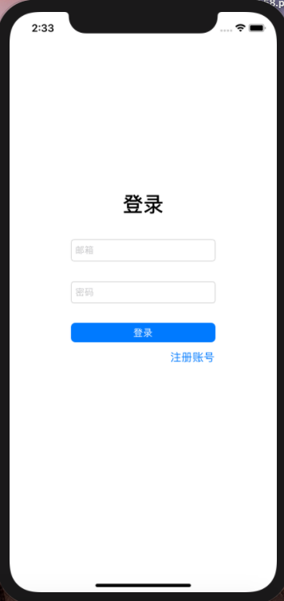
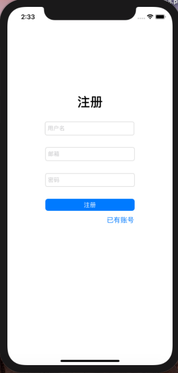
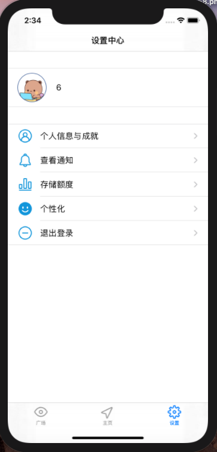
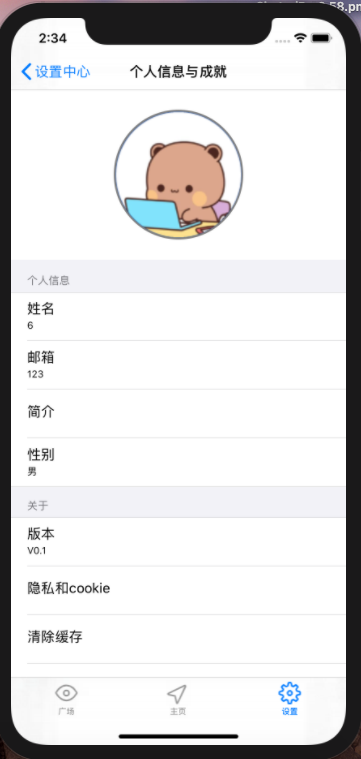
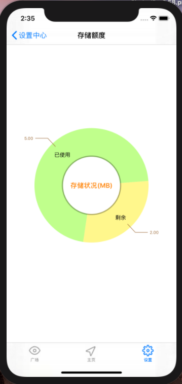

# 中山大学数据科学与计算机学院本科生实验报告
## （2020年秋季学期）
| 课程名称 | IOS现代操作系统应用开发 | 任课老师 | 郑贵锋 |
| :------------: | :-------------: | :------------: | :-------------: |
| 年级 | 2018级 | 专业（方向） | 软件工程专业 |
| 学号 | 18342069 | 姓名 | 罗炜乐 |
| 电话 | 18027303477 | Email |luowle@foxmail.com|
| 开始日期 | 2020.11 | 完成日期 | 2020.12|

---

## 一、实验题目
## 期中项目 -- 校园社交App

---

## 二、实现内容
### 本人负责的应用的实现部分：

- 设置页面
- 个人信息页面
- 存储额度页面
- 登陆页面
- 注册页面
- 点赞功能
- 更名功能

---

## 三、实验结果
### (1)实验截图
#### 我负责设计编写的页面效果如下：

|                           登陆页面                           |                           注册页面                           |                           设置页面                           |                         个人信息页面                         |                           存储页面                           |
| :----------------------------------------------------------: | :----------------------------------------------------------: | :----------------------------------------------------------: | :----------------------------------------------------------: | :----------------------------------------------------------: |
|  |  |  |  |  |

### (2)实验步骤以及关键代码

#### 登陆注册页面

页面样式使用 `xib` 实现

登陆和主页按钮会发起网络请求，网络请求是异步的，请求完成后会在主线程后去除登陆/注册页面。

```objc
# pragma mark 登录/注册
- (IBAction)logInOrSignUp:(id)sender
{
    NSLog(@"%@", _isLogIn?@"YES":@"NO");
    if(_isLogIn)
    {
        [AppDelegate login:[_emailField text] withPassword:[_passwordField text] withCallback:^{
            [self.view removeFromSuperview];
            [self didMoveToParentViewController:self];
            ((UITableViewController*)[self parentViewController]).tabBarController.tabBar.hidden = NO;
            ((UITableViewController*)[self parentViewController]).navigationController.navigationBar.hidden = NO;
            [((UITableViewController*)[self parentViewController]).tableView reloadData];
            [((UITableViewController*)[self parentViewController]).tableView refreshControl];
            [self removeFromParentViewController];
        }];
    }
    else
    {
        [AppDelegate signup:[_usernameField text] withEmail:[_emailField text] withPassword:[_passwordField text] withCallback:^{
            [self.view removeFromSuperview];
            [self didMoveToParentViewController:self];
            ((UITableViewController*)[self parentViewController]).tabBarController.tabBar.hidden = NO;
            ((UITableViewController*)[self parentViewController]).navigationController.navigationBar.hidden = NO;
            [((UITableViewController*)[self parentViewController]).tableView reloadData];
            [((UITableViewController*)[self parentViewController]).tableView refreshControl];
            [self removeFromParentViewController];
        }];
    }
}
```

#### 设置页面

设置页面使用了 `UITableViewController`

#### 个人信息页面

个人信息页面使用了 `UITableViewController`

#### 存储额度页面

存储额度页面使用了 `Charts` 库。

该库是 `Swift` 语言的，因此本项目使用了 `Objective-c` 和 `Swift` 混编。

设置样式的代码如下

```objc
- (PieChartData *)setData{
    //每个区块的数据
    PieChartDataEntry *used = [[PieChartDataEntry alloc] initWithValue:([AppDelegate getUserModel].UsedSize)/1048576 label:@"已使用"];
    PieChartDataEntry *remain = [[PieChartDataEntry alloc] initWithValue:([AppDelegate getUserModel].MaxSize - [AppDelegate getUserModel].UsedSize)/1048576 label:@"剩余"];
    NSMutableArray *yVals = [[NSMutableArray alloc] initWithObjects:used, remain, nil];

    //dataSet
    PieChartDataSet *dataSet = [[PieChartDataSet alloc] initWithEntries:yVals];
    dataSet.drawValuesEnabled = YES;//是否绘制显示数据
    NSMutableArray *colors = [[NSMutableArray alloc] init];
    [colors addObjectsFromArray:ChartColorTemplates.vordiplom];
    [colors addObjectsFromArray:ChartColorTemplates.joyful];
    dataSet.colors = colors;//区块颜色
    dataSet.entryLabelColor = [UIColor blackColor];
    dataSet.sliceSpace = 0;//相邻区块之间的间距
    dataSet.selectionShift = 8;//选中区块时, 放大的半径
    dataSet.xValuePosition = PieChartValuePositionInsideSlice;//名称位置
    dataSet.yValuePosition = PieChartValuePositionOutsideSlice;//数据位置
    //数据与区块之间的用于指示的折线样式
    dataSet.valueLinePart1OffsetPercentage = 0.85;//折线中第一段起始位置相对于区块的偏移量, 数值越大, 折线距离区块越远
    dataSet.valueLinePart1Length = 0.5;//折线中第一段长度占比
    dataSet.valueLinePart2Length = 0.4;//折线中第二段长度最大占比
    dataSet.valueLineWidth = 1;//折线的粗细
    dataSet.valueLineColor = [UIColor brownColor];//折线颜色
    
    //data
    PieChartData *data = [[PieChartData alloc] initWithDataSet:dataSet];
    NSNumberFormatter *formatter = [[NSNumberFormatter alloc] init];
    formatter.numberStyle = NSNumberFormatterPercentStyle;
    formatter.maximumFractionDigits = 0;//小数位数
    formatter.multiplier = @1.f;
    //[data setValueFormatter:formatter];//设置显示数据格式
    [data setValueTextColor:[UIColor brownColor]];
    [data setValueFont:[UIFont systemFontOfSize:10]];
    
    return data;
}
```

设置数据的代码如下

```objc
- (PieChartData *)setData{
    //每个区块的数据
    PieChartDataEntry *used = [[PieChartDataEntry alloc] initWithValue:([AppDelegate getUserModel].UsedSize)/1048576 label:@"已使用"];
    PieChartDataEntry *remain = [[PieChartDataEntry alloc] initWithValue:([AppDelegate getUserModel].MaxSize - [AppDelegate getUserModel].UsedSize)/1048576 label:@"剩余"];
    NSMutableArray *yVals = [[NSMutableArray alloc] initWithObjects:used, remain, nil];

    //dataSet
    PieChartDataSet *dataSet = [[PieChartDataSet alloc] initWithEntries:yVals];
    dataSet.drawValuesEnabled = YES;//是否绘制显示数据
    NSMutableArray *colors = [[NSMutableArray alloc] init];
    [colors addObjectsFromArray:ChartColorTemplates.vordiplom];
    [colors addObjectsFromArray:ChartColorTemplates.joyful];
    dataSet.colors = colors;//区块颜色
    dataSet.entryLabelColor = [UIColor blackColor];
    dataSet.sliceSpace = 0;//相邻区块之间的间距
    dataSet.selectionShift = 8;//选中区块时, 放大的半径
    dataSet.xValuePosition = PieChartValuePositionInsideSlice;//名称位置
    dataSet.yValuePosition = PieChartValuePositionOutsideSlice;//数据位置
    //数据与区块之间的用于指示的折线样式
    dataSet.valueLinePart1OffsetPercentage = 0.85;//折线中第一段起始位置相对于区块的偏移量, 数值越大, 折线距离区块越远
    dataSet.valueLinePart1Length = 0.5;//折线中第一段长度占比
    dataSet.valueLinePart2Length = 0.4;//折线中第二段长度最大占比
    dataSet.valueLineWidth = 1;//折线的粗细
    dataSet.valueLineColor = [UIColor brownColor];//折线颜色
    
    //data
    PieChartData *data = [[PieChartData alloc] initWithDataSet:dataSet];
    NSNumberFormatter *formatter = [[NSNumberFormatter alloc] init];
    formatter.numberStyle = NSNumberFormatterPercentStyle;
    formatter.maximumFractionDigits = 0;//小数位数
    formatter.multiplier = @1.f;
    //[data setValueFormatter:formatter];//设置显示数据格式
    [data setValueTextColor:[UIColor brownColor]];
    [data setValueFont:[UIFont systemFontOfSize:10]];
    
    return data;
}
```

#### 点赞功能

点赞功能使用异步网络请求，步骤如下：

1. 先用一个字典存储需要发送的数据
2. 把字典转化成 `json`
3. 异步发起 `request` 请求

```objc
+(void)likeWithContent:(NSString*)contentID isContent:(NSObject*)isContent isComment:(NSObject*)isComment isReply:(NSObject*)isReply {
    NSURLSession * session = [NSURLSession sharedSession];
    NSString *urlString = [NSString stringWithFormat:@"http://172.18.178.56/api/like/%@", contentID];
    urlString=[urlString stringByAddingPercentEncodingWithAllowedCharacters:[NSCharacterSet URLQueryAllowedCharacterSet]];
    NSMutableURLRequest *request = [[NSMutableURLRequest alloc] init];
    [request setURL:[NSURL URLWithString:urlString]];
    [request setHTTPMethod:@"POST"];
    NSMutableDictionary* data = [[NSMutableDictionary alloc] init];
    [data setObject:isContent forKey:@"isContent"];
    [data setObject:isComment forKey:@"isComment"];
    [data setObject:isReply forKey:@"isReply"];
    NSData* json = [NSJSONSerialization dataWithJSONObject:data options:NSJSONWritingSortedKeys error:nil];
    [request setHTTPBody:json];
    [request setValue:@"application/json" forHTTPHeaderField:@"Content-Type"];
    [request setValue:@"application/json" forHTTPHeaderField:@"Accept"];
    NSURLSessionDataTask *task = [session dataTaskWithRequest:request completionHandler:^(NSData * _Nullable data, NSURLResponse * _Nullable response, NSError * _Nullable error) {
        NSString * str = [[NSString alloc]initWithData:data encoding:NSUTF8StringEncoding];
        NSLog(@"%@", str);
        // [self getUserData:callback];
    }];
    [task resume];
}
```


#### 更名功能

1. 前三步与点赞功能一样
2. 执行完前三步后需要在主线程执行回调函数（上面代码的19行），回调函数在这里是刷新UI，使页面显示更新为新的名字。

网络请求的代码和上面大同小异，故不重复展示。该调用该改名 API 的部分代码如下所示。

```objc
[alertController addAction:[UIAlertAction actionWithTitle:@"确定" style:UIAlertActionStyleDefault handler:^(UIAlertAction * _Nonnull action) {
    //获取第1个输入框；
    UITextField *userNameTextField = alertController.textFields.firstObject;
    NSLog(@"%@",userNameTextField.text);
    [AppDelegate updateName:userNameTextField.text withCallback:^{
        [self.info.tableView reloadData];
        [self.info.tableView refreshControl];
        [self.father.tableView reloadData];
        [self.father.tableView refreshControl];
    }];
}]];
```


### (3)实验遇到的困难以及解决思路

1. 想用 `Charts` 这个 `Swift` 库。解决方法：生成一个桥接文件进行联编。
2. 人不在校园网，校园网 VPN 只支持22、80、443端口，假 API没法用。解决方法：用假 API 的时候暂时搞一个内网穿透。


## 四、实验思考及感想

1. 这次是本门课第一次多人协作。看到其他组员的一些代码编写技巧和工具使用技巧让我觉得大开眼界，涨了不少见识。

2. 本次项目让我学习了网络编程相关知识。
3. 完成本次项目后我对我们现在所使用的应用程序时如何运作有了更清晰的了解，对前后端分离有了更深刻的认识。
4. 学会了 `Objective-C` 和 `Swift` 混编。
5. 本次项目感觉以我一人之力没有办法短时间内完成，让我体会到团队协作的重要性。