### 基础UI设计
UI主要设计到个人主页、广场以及个人中心的设计：  
|个人主页|发现广场|个人中心|
|-|-|-|
|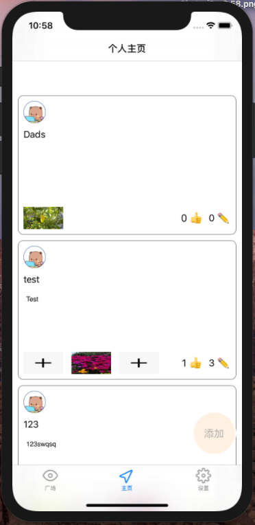|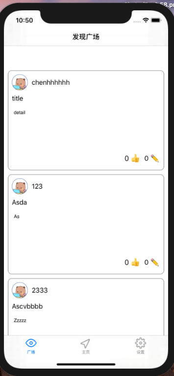|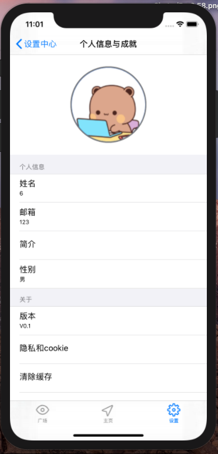|

### 产品使用方法
#### 个人中心信息展示

#### 更改名字
点击姓名栏即可修改用户名。  
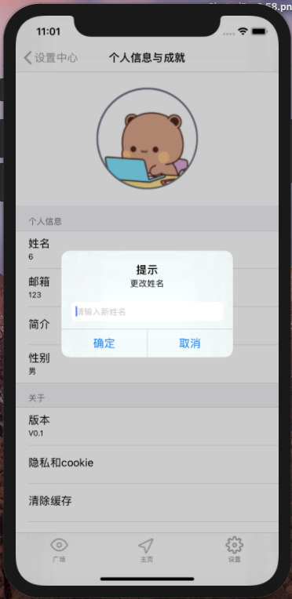

#### 注册
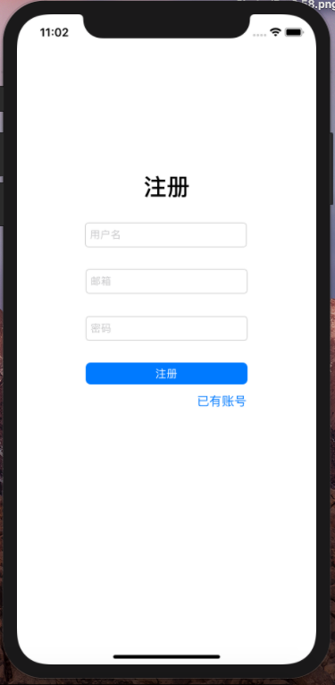

#### 登录
在个人中心点击登录按钮即可弹出输入用户名和密码，进行登录。  
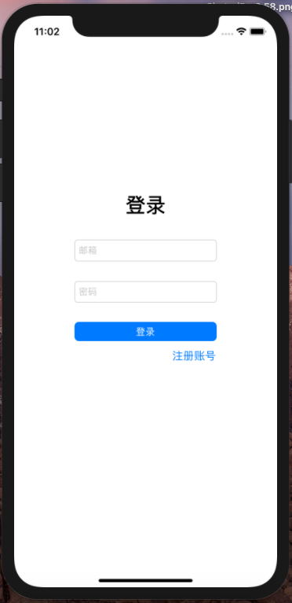

#### 个人主页

#### 发布动态
点击发布按钮，即可弹出输入界面，按照提示输入然后点击发布，完成动态发布。  
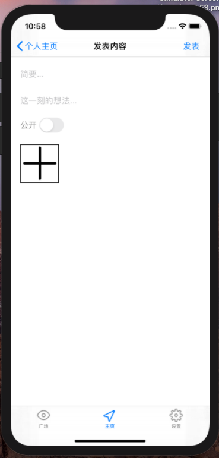

#### 发现广场

#### 广场动态详情
点击想要查看的动态，即可查看该动态详情。  
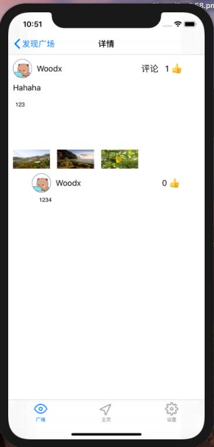

#### 查看大图
点击相应图片即可查看大图。  
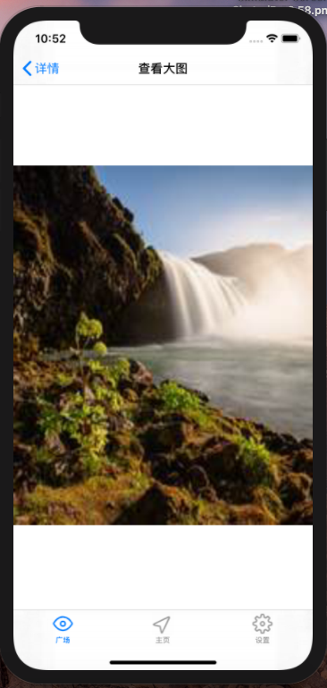

#### 点赞
点击点赞按钮进行点赞。  

#### 评论
评论前：  
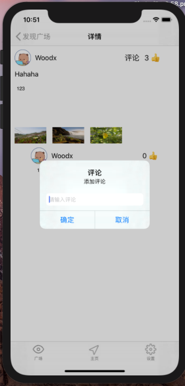

添加评论后：  
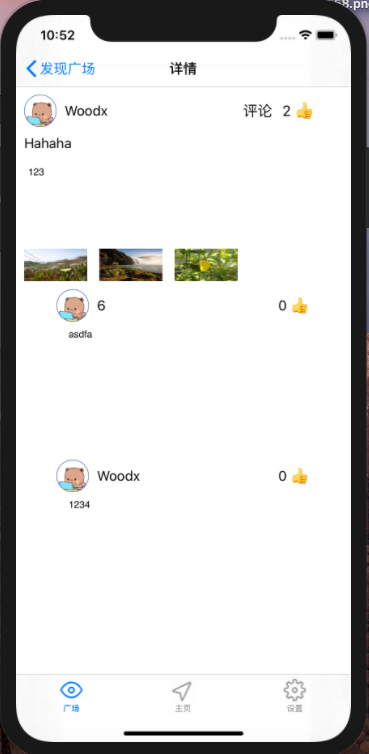

#### 删除动态
在详情页点击删除按钮即可删除。  
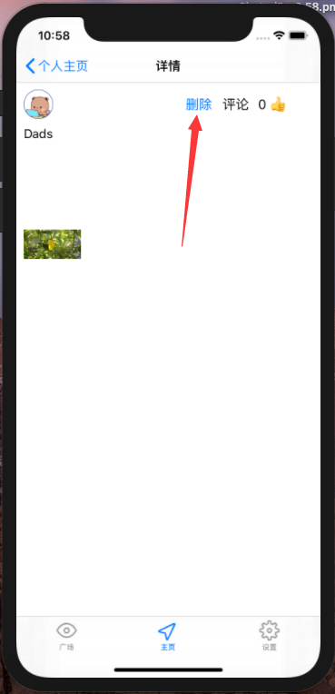

#### 通知页
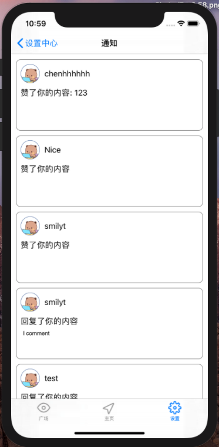